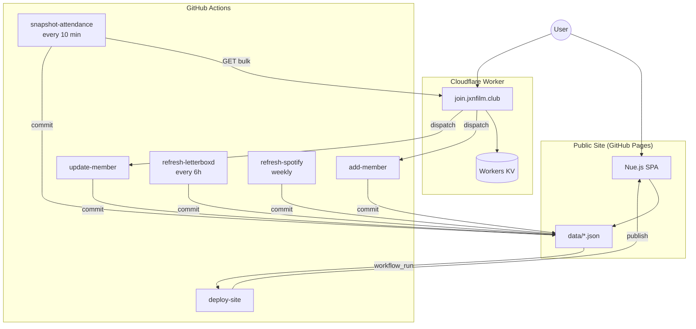

# Feature Documentation

Detailed documentation of every user-facing feature in jxnfilm.club, including Mermaid sequence and flow diagrams.

## Features

| Feature | Description |
|---------|-------------|
| [Signup](signup.md) | New member registration via join.jxnfilm.club |
| [Sign-in](signin.md) | Passwordless OTP login for returning members |
| [Member Profile](member-profile.md) | Display name, pronouns, and Letterboxd verification |
| [Attendance](attendance.md) | Self-report event attendance (mark + remove) |
| [Events Directory](events.md) | Public event listing with search, filters, and attendance |
| [Members Directory](members-directory.md) | Public member listing with search and sort |
| [Last Four Watched](watched.md) | Per-member film poster gallery from Letterboxd RSS |
| [Home Page](home.md) | Landing page with podcast embed and episode list |
| [Deployment](deployment.md) | CI/CD for the static site and Cloudflare Worker |
| [Navigation](navigation.md) | SPA routing, auth state, session management |

## Architecture Overview

## Timing Reference

| Constant | Value | Context |
|----------|-------|---------|
| OTP code TTL | 10 minutes | Signup + sign-in |
| Letterboxd verification tag TTL | 48 hours | Letterboxd linking |
| Session token expiry | 1 hour | All authenticated features |
| Letterboxd data refresh | Every 6 hours | Watched films pipeline |
| Spotify episodes refresh | Weekly (Monday noon UTC) | Podcast pipeline |
| Site rebuild (user-facing estimate) | ~30 seconds | After profile save |
