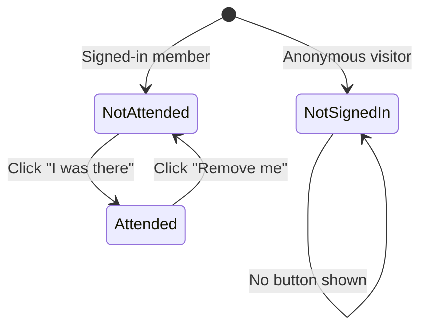

# Event Attendance

Authenticated members can self-report attendance at events. The button on each event row toggles between "I was there" and "Remove me" based on the signed-in member's current state. `ATTENDANCE_KV` is the single live source of truth; a scheduled workflow snapshots KV into the archival `data/attendance.json` ledger every 10 minutes, and the ledger seeds KV exactly once when a new namespace is brought up.

## Mark Attendance

```mermaid
sequenceDiagram
    actor User
    participant Events as jxnfilm.club/events
    participant Worker as Cloudflare Worker
    participant Cron as Snapshot workflow<br/>(every 10 min)
    participant JSON as data/attendance.json

    User->>Events: Sees "I was there" on an event
    User->>Events: Clicks "I was there"
    Events->>Worker: POST /events/{id}/attend (bearer token)
    Worker->>Worker: Read attend:{id} (fallback to attendance:all)
    Worker->>Worker: Append name; write-through to<br/>attend:{id} + attendance:all
    Worker-->>Events: { attendees: [...] }
    Events->>User: Button flips to "Remove me",<br/>name appears in attendee list

    Note over Cron,Worker: Runs on cron, independent of clicks
    Cron->>Worker: GET /events/attendance (single KV GET of attendance:all)
    Worker-->>Cron: { attendance: {...} }
    Cron->>JSON: Rewrite file, commit if changed
```

## Remove Attendance

```mermaid
sequenceDiagram
    actor User
    participant Events as jxnfilm.club/events
    participant Worker as Cloudflare Worker

    User->>Events: Sees "Remove me" on an attended event
    User->>Events: Clicks "Remove me"
    Events->>Worker: DELETE /events/{id}/attend (bearer token)
    Worker->>Worker: Splice name; write-through to<br/>attend:{id} + attendance:all
    Worker-->>Events: { attendees: [...] }
    Events->>User: Button flips back to "I was there"

    Note over Worker: Ledger catches up on the next cron tick
```

## Button States



## Data Flow

`ATTENDANCE_KV` is the sole live source of truth. The repo ledger `data/attendance.json` is an archival snapshot, plus a one-shot bootstrap source when the KV namespace is cold.

**KV layout:**

| Key | Role |
|-----|------|
| `attend:{eventId}` | Canonical per-event attendee array |
| `attendance:all` | Aggregate `{ eventId: [names] }` — the bulk endpoint's O(1) read path |
| `attendance:bootstrapped` | Marker; presence means the repo→KV seed has already run |

**Reads:** `GET /events/attendance` is a single KV GET of `attendance:all`. `GET /events/:id/attendance` reads `attend:{id}` (falling back to the aggregate for events that don't have a per-event key yet). The hot path never fetches from GitHub raw.

**Writes:** `POST`/`DELETE /events/:id/attend` writes through to both `attend:{id}` and `attendance:all`, so the next bulk read reflects the change without extra work.

**Bootstrap:** on the first read against a fresh namespace, `bootstrapAttendance` fetches `https://raw.githubusercontent.com/<owner>/<repo>/<branch>/data/attendance.json`, seeds both `attendance:all` and every `attend:{id}` (live per-event entries, if any, win over baseline), then writes `attendance:bootstrapped`. Subsequent reads skip the network entirely.

The UI hydrates from `GET /events/attendance`. If the Worker is unreachable it renders an "attendance data is temporarily unavailable" banner rather than falling back to a potentially-stale static JSON; that keeps the displayed answer consistent with whatever the next successful fetch returns. After a click, the UI trusts the Worker's POST/DELETE response and mutates its local attendance map in place — no reconcile round-trip.

The attendee identifier is the member's **display name** (not Letterboxd handle), so members without Letterboxd can participate.

## Persistence Cadence

`.github/workflows/snapshot-attendance.yml` runs every 10 minutes (and on-demand via `workflow_dispatch`). It:

1. `GET`s `https://join.jxnfilm.club/events/attendance` (one KV read of `attendance:all`).
2. Sanity-checks the response shape.
3. Rewrites `data/attendance.json` with the returned map.
4. Commits only if the file actually changed.

This replaces the previous per-click `repository_dispatch` model. Rapid toggles no longer queue independent workflow runs, and the ledger converges within one cron tick of the last change.

## Environments

| Env | KV writes | Snapshot workflow target | Reads `data/attendance.json`? |
|-----|-----------|--------------------------|-------------------------------|
| Production (`ENVIRONMENT=production`) | yes | `join.jxnfilm.club` (scheduled) | once per namespace, via `bootstrapAttendance` |
| Staging (`ENVIRONMENT=staging`) | yes | none — staging is not snapshotted | once per namespace, via `bootstrapAttendance` |
| E2E (`E2E_MODE=true`) | yes | n/a | skipped — tests seed KV directly |

Staging shares the prod ledger only for seeding (read-only). Staging clicks stay in staging KV and are never committed anywhere.

## Attendee Display

- Members with a linked Letterboxd handle: name rendered as a link to their Letterboxd profile
- Members without Letterboxd: name rendered as plain text
- The list comma-separates and wraps inside the attendance cell so many attendees don't blow out the column

## Error States

| Condition | HTTP | Behavior |
|-----------|------|----------|
| Not authenticated | 401 | Button not shown (frontend guard) |
| Member not found | 404 | "member not found" |
| Already attending (re-click) | 200 | Idempotent, no duplicate KV write |
| Not attending (re-remove) | 200 | No-op |
| Worker unreachable at hydrate | — | UI renders attendance-unavailable banner, toggle buttons hidden |
| Snapshot fetch fails in cron | workflow fails | Next tick retries; KV state unaffected |

## Maintenance Notes

- **Deploying new Worker code**: no special KV migration is needed. KV keeps its contents across deploys.
- **Creating a new KV namespace**: no import step required — the first read against the new namespace triggers `bootstrapAttendance`, which seeds `attendance:all` + every `attend:{id}` from the raw JSON and writes `attendance:bootstrapped`. This happens exactly once.
- **Re-bootstrapping from the ledger** (e.g. after a bad manual edit): delete `attendance:bootstrapped` in the KV namespace; the next read re-seeds from `data/attendance.json`, preserving any live per-event entries that already exist.
- **Forcing an immediate snapshot**: `gh workflow run snapshot-attendance.yml` (or the Actions tab "Run workflow" button).
- **Rolling back**: `data/attendance.json` is the archival record. Reverting a commit rolls back the ledger; the next cron tick will rewrite the file from live KV state. If you want to revert BOTH KV and the ledger, wipe `attend:*` and `attendance:*` KV keys first (including `attendance:bootstrapped`), then revert the commit — the next read will re-bootstrap from the reverted JSON.
- **Staging isolation check**: after clicking in staging, confirm no snapshot commit lands. Staging KV never drives the snapshot workflow (it only queries prod's Worker).

## Local Testing

The snapshot workflow can be exercised locally with [`act`](https://github.com/nektos/act) — see [`docs/SETUP.md` §12](../SETUP.md#12-smoke-test-attendance-locally-with-act). For development iteration, `wrangler dev` alone is usually enough — KV updates are visible immediately via `GET /events/attendance`, no workflow needed.

## Key Files

| File | Role |
|------|------|
| `worker/src/index.js` | `handleAttend()`, `handleUnattend()`, `handleAttendanceGet()`, `handleAttendanceMap()`, `readAttendees()`, `readAttendanceAll()`, `writeAttendees()`, `bootstrapAttendance()`, `fetchAttendanceBaseline()` |
| `worker/wrangler.toml` | `ENVIRONMENT` + `GITHUB_BRANCH` vars |
| `ui/views.html` | `events-view` loads + passes attendees to each `event-card`; `event-card` owns the attend/remove toggle |
| `css/cards.css` | `.attendance-list`, `.attend-btn`, `.attendance-unavailable` styles |
| `.github/workflows/snapshot-attendance.yml` | Cron-driven ledger snapshot |
| `data/attendance.json` | Durable ledger |
| `tests/worker/attendance.test.js` | Worker unit tests |
