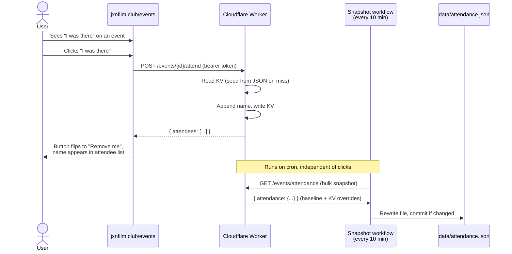
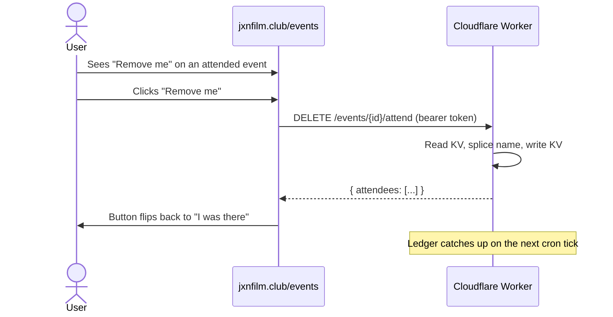
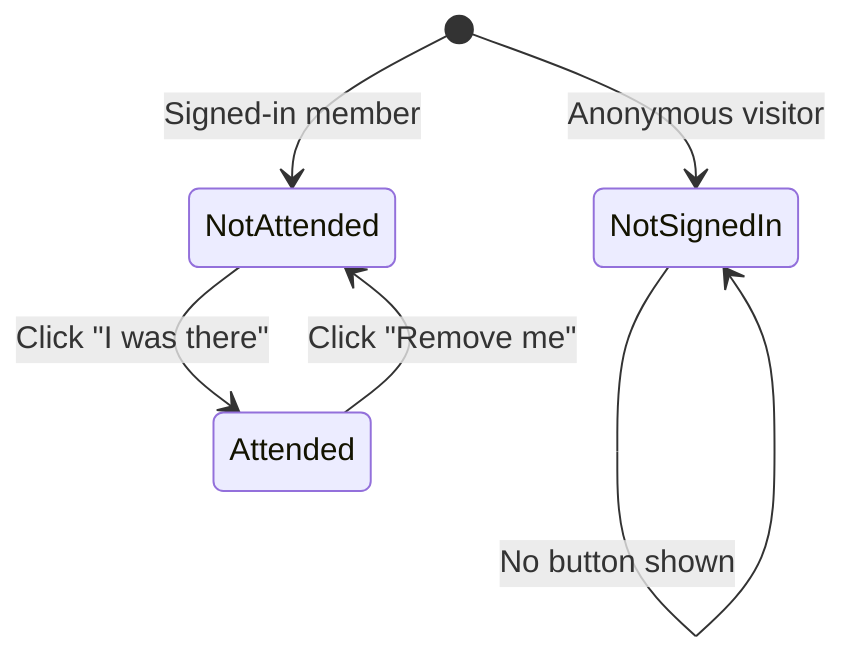

# Event Attendance

Authenticated members can self-report attendance at events. The button on each event row toggles between "I was there" and "Remove me" based on the signed-in member's current state. The Worker's KV is the live source of truth; a scheduled workflow snapshots KV into the durable `data/attendance.json` ledger every 10 minutes.

## Mark Attendance

## Remove Attendance

## Button States

## Data Flow

Attendance is served through a two-tier read:

1. **ATTENDANCE_KV** (Worker KV) — primary; reflects live self-reports immediately.
2. **`data/attendance.json`** (git) — durable ledger; periodic snapshot from KV.

On a KV miss, the Worker fetches `https://raw.githubusercontent.com/<owner>/<repo>/<branch>/data/attendance.json` (cached at the Cloudflare edge for 60s), plucks the event's array, writes it to KV, and returns it. That makes the Worker self-healing: no manual seed step is required when adding a new KV namespace or after a cache wipe.

The UI hydrates from `GET /events/attendance` (Worker bulk endpoint) which merges the JSON baseline with any KV overrides. The static JSON is only used as a fallback if the Worker is unreachable. After a click, the UI trusts the Worker's POST/DELETE response and mutates its local attendance map in place — no reconcile round-trip.

The attendee identifier is the member's **display name** (not Letterboxd handle), so members without Letterboxd can participate.

## Persistence Cadence

`.github/workflows/snapshot-attendance.yml` runs every 10 minutes (and on-demand via `workflow_dispatch`). It:

1. `GET`s `https://join.jxnfilm.club/events/attendance` (the live Worker bulk endpoint).
2. Sanity-checks the response shape.
3. Rewrites `data/attendance.json` with the merged baseline + KV state.
4. Commits only if the file actually changed.

This replaces the previous per-click `repository_dispatch` model. Rapid toggles no longer queue independent workflow runs, and the ledger converges within one cron tick of the last change.

## Environments

| Env | KV writes | Snapshot workflow target | Reads `data/attendance.json`? |
|-----|-----------|--------------------------|-------------------------------|
| Production (`ENVIRONMENT=production`) | yes | `join.jxnfilm.club` (scheduled) | yes, for KV miss seeding |
| Staging (`ENVIRONMENT=staging`) | yes | none — staging is not snapshotted | yes, for KV miss seeding |
| E2E (`E2E_MODE=true`) | yes | n/a | skipped — tests seed KV directly |

Staging shares the prod ledger only for seeding (read-only). Staging clicks stay in staging KV and are never committed anywhere.

## Attendee Display

- Members with a linked Letterboxd handle: name rendered as a link to their Letterboxd profile
- Members without Letterboxd: name rendered as plain text
- The list comma-separates and wraps inside the attendance cell so many attendees don't blow out the column

## Error States

| Condition | HTTP | Behavior |
|-----------|------|----------|
| Not authenticated | 401 | Button not shown (frontend guard) |
| Member not found | 404 | "member not found" |
| Already attending (re-click) | 200 | Idempotent, no duplicate KV write |
| Not attending (re-remove) | 200 | No-op |
| Worker unreachable at hydrate | — | UI falls back to `data/attendance.json` |
| Snapshot fetch fails in cron | workflow fails | Next tick retries; KV state unaffected |

## Maintenance Notes

- **Deploying new Worker code**: no special KV migration is needed. KV keeps its contents across deploys, and any missing `attend:{id}` keys self-seed on first read.
- **Creating a new KV namespace**: no import step required — first read of each event seeds from the raw JSON.
- **Forcing an immediate snapshot**: `gh workflow run snapshot-attendance.yml` (or the Actions tab "Run workflow" button).
- **Rolling back**: `data/attendance.json` is the durable record. Reverting a commit rolls back the ledger; the next cron tick will rewrite the file from live KV state. If you want to revert BOTH KV and the ledger, wipe the relevant `attend:*` KV keys first, then revert the commit.
- **Staging isolation check**: after clicking in staging, confirm no snapshot commit lands. Staging KV never drives the snapshot workflow (it only queries prod's Worker).

## Local Testing

The snapshot workflow can be exercised locally with [`act`](https://github.com/nektos/act) — see [`docs/SETUP.md` §12](../SETUP.md#12-smoke-test-attendance-locally-with-act). For development iteration, `wrangler dev` alone is usually enough — KV updates are visible immediately via `GET /events/attendance`, no workflow needed.

## Key Files

| File | Role |
|------|------|
| `worker/src/index.js` | `handleAttend()`, `handleUnattend()`, `handleAttendanceGet()`, `handleAttendanceMap()`, `fetchAttendanceBaseline()` |
| `worker/wrangler.toml` | `ENVIRONMENT` + `GITHUB_BRANCH` vars |
| `ui/views.html` | events-view attendance toggle, in-place mutation of attendance map |
| `css/table.css` | `.attendance-list` wrapping + comma separators |
| `.github/workflows/snapshot-attendance.yml` | Cron-driven ledger snapshot |
| `data/attendance.json` | Durable ledger |
| `tests/worker/attendance.test.js` | Worker unit tests |
