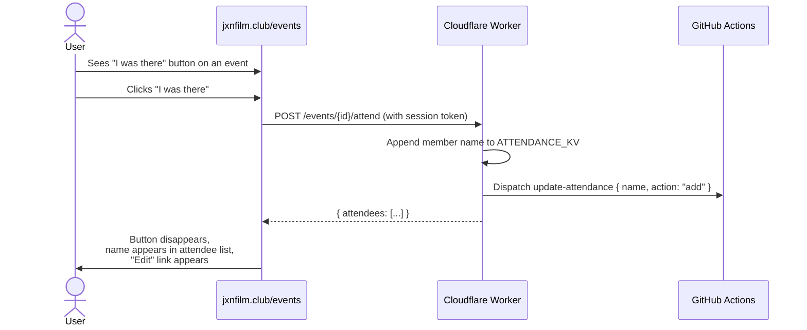
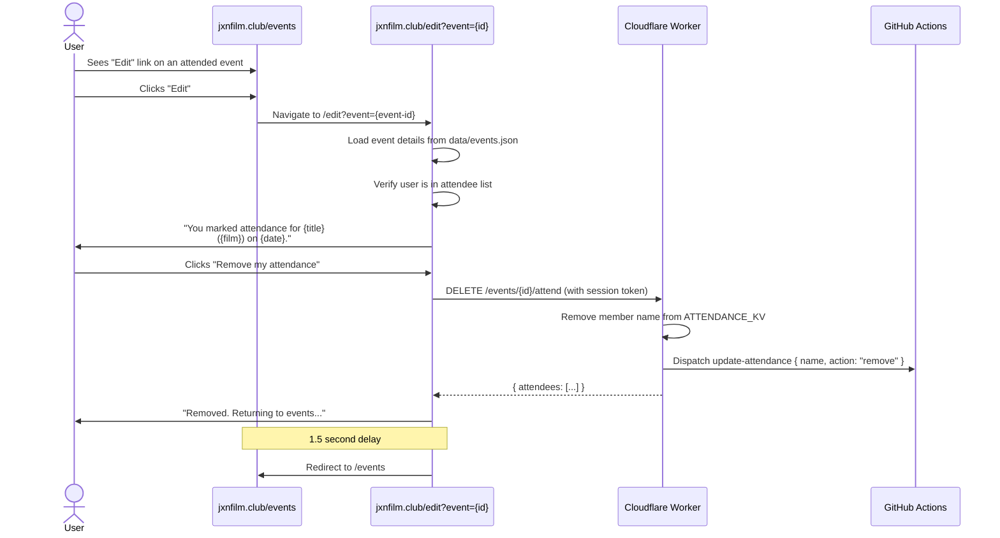
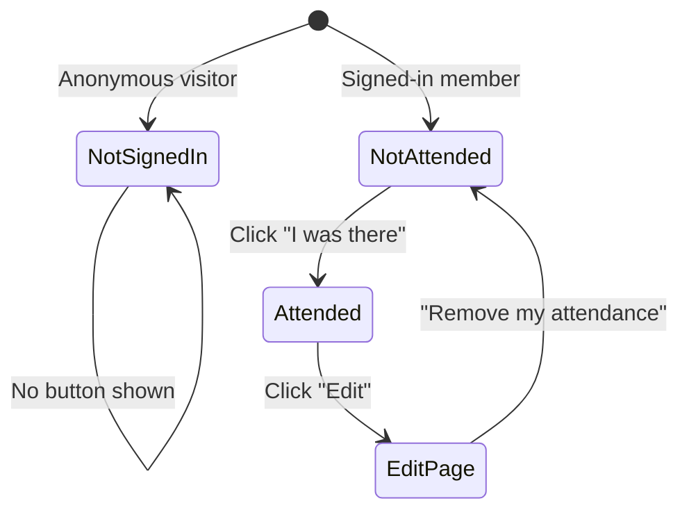

# Event Attendance

Authenticated members can self-report attendance at events. Marking attendance is a one-click action on the events page; removing attendance is a deliberate action on the edit page.

## Mark Attendance

## Remove Attendance

## Button States

## Data Flow

Attendance is stored in two places:
1. **ATTENDANCE_KV** (Worker KV) -- source of truth for real-time reads
2. **data/attendance.json** (git) -- committed by the update-attendance workflow for the static site

The attendee identifier is the member's **display name** (not Letterboxd handle), so members without Letterboxd can participate.

## Attendee Display

- Members with a linked Letterboxd handle: name rendered as a link to their Letterboxd profile
- Members without Letterboxd: name rendered as plain text

## Error States

| Condition | HTTP | Behavior |
|-----------|------|----------|
| Not authenticated | 401 | Button not shown (frontend guard) |
| Member not found | 404 | "member not found" |
| Already attending (re-click) | 200 | Idempotent, no duplicate, no re-dispatch |
| Not attending (re-remove) | 200 | No-op, no dispatch |

## Key Files

| File | Role |
|------|------|
| `worker/src/index.js` | `handleAttend()`, `handleUnattend()`, `handleAttendanceGet()` |
| `ui/views.html` | events-view attendance buttons + "Edit" link |
| `ui/auth.html` | edit-view attendance panel (removal) |
| `.github/workflows/update-attendance.yml` | Commits attendance changes |
| `data/attendance.json` | Static attendance data |
| `tests/worker/attendance.test.js` | 8 unit tests |
