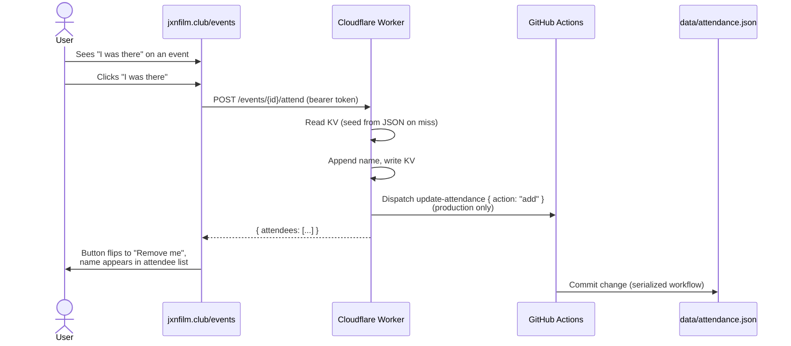
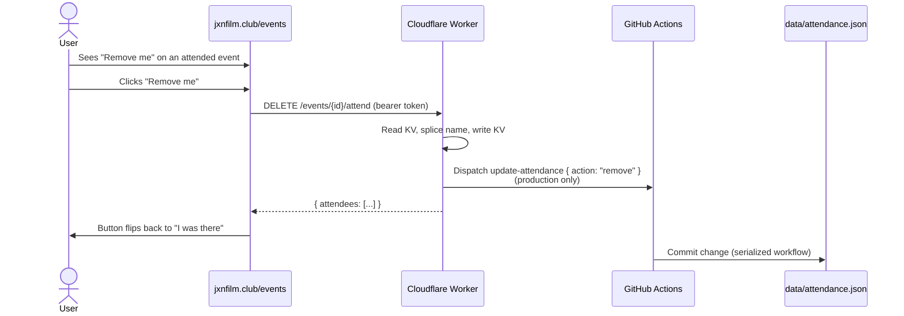
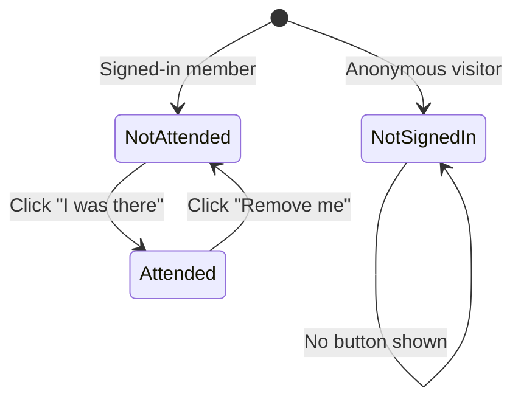

# Event Attendance

Authenticated members can self-report attendance at events. The button on each event row toggles between "I was there" and "Remove me" based on the signed-in member's current state. The Worker's KV is the live source of truth; `data/attendance.json` is the durable ledger.

## Mark Attendance



## Remove Attendance



## Button States



## Data Flow

Attendance is served through a two-tier read:

1. **ATTENDANCE_KV** (Worker KV) — primary; reflects live self-reports immediately.
2. **`data/attendance.json`** (git) — durable ledger; committed by the `update-attendance` workflow.

On a KV miss, the Worker fetches `https://raw.githubusercontent.com/<owner>/<repo>/<branch>/data/attendance.json` (cached at the Cloudflare edge for 60s), plucks the event's array, writes it to KV, and returns it. That makes the Worker self-healing: no manual seed step is required when adding a new KV namespace or after a cache wipe.

The UI hydrates from `GET /events/attendance` (Worker bulk endpoint) which merges the JSON baseline with any KV overrides. The static JSON is only used as a fallback if the Worker is unreachable.

The attendee identifier is the member's **display name** (not Letterboxd handle), so members without Letterboxd can participate.

## Environments

| Env | KV writes | Dispatch `update-attendance`? | Reads `data/attendance.json`? |
|-----|-----------|------------------------------|-------------------------------|
| Production (`ENVIRONMENT=production`) | yes | yes (commits to main) | yes, for KV miss seeding |
| Staging (`ENVIRONMENT=staging`) | yes | **no** — staging never pollutes prod ledger | yes, for KV miss seeding |
| E2E (`E2E_MODE=true`) | yes | stubbed via `__last_dispatch__` sentinel | skipped — tests seed KV directly |

Because staging skips the dispatch, the shared `data/attendance.json` stays clean. Staging KV seeds from the same prod JSON on miss, so the staging UI sees realistic baseline data; new clicks in staging only persist until the KV namespace is wiped.

## Concurrency

`.github/workflows/update-attendance.yml` sets:

```yaml
concurrency:
  group: update-attendance
  cancel-in-progress: false
```

This queues dispatches so two rapid clicks can't race on `data/attendance.json`. Every dispatch is applied in order.

## Attendee Display

- Members with a linked Letterboxd handle: name rendered as a link to their Letterboxd profile
- Members without Letterboxd: name rendered as plain text

## Error States

| Condition | HTTP | Behavior |
|-----------|------|----------|
| Not authenticated | 401 | Button not shown (frontend guard) |
| Member not found | 404 | "member not found" |
| Already attending (re-click) | 200 | Idempotent, no duplicate, no re-dispatch |
| Not attending (re-remove) | 200 | No-op, no dispatch |
| Worker unreachable at hydrate | — | UI falls back to `data/attendance.json` |

## Maintenance Notes

- **Deploying new Worker code**: no special KV migration is needed. KV keeps its contents across deploys, and any missing `attend:{id}` keys self-seed on first read.
- **Creating a new KV namespace**: no import step required — first read of each event seeds from the raw JSON.
- **Backfilling KV from JSON manually** (if you want to avoid first-request latency): `wrangler kv key put --binding=ATTENDANCE_KV attend:<event-id> '<json-array>'`, optionally scripted by walking `data/attendance.json`.
- **Rolling back**: `data/attendance.json` is the durable record. Reverting a commit rolls back the ledger; KV can be wiped to re-seed from the reverted file.
- **Staging isolation check**: after clicking in staging, confirm no `update-attendance` workflow run appears in GitHub Actions.

## Local Testing

See [`docs/SETUP.md` §12](../SETUP.md#12-smoke-test-attendance-locally-with-act) for running the `update-attendance` workflow against a disposable copy of `data/attendance.json` using [`act`](https://github.com/nektos/act).

## Key Files

| File | Role |
|------|------|
| `worker/src/index.js` | `handleAttend()`, `handleUnattend()`, `handleAttendanceGet()`, `handleAttendanceMap()`, `fetchAttendanceBaseline()` |
| `worker/wrangler.toml` | `ENVIRONMENT` + `GITHUB_BRANCH` vars controlling dispatch + seeding |
| `ui/views.html` | events-view attendance toggle |
| `.github/workflows/update-attendance.yml` | Serialized workflow; commits attendance changes |
| `data/attendance.json` | Durable ledger |
| `tests/worker/attendance.test.js` | Worker unit tests |
