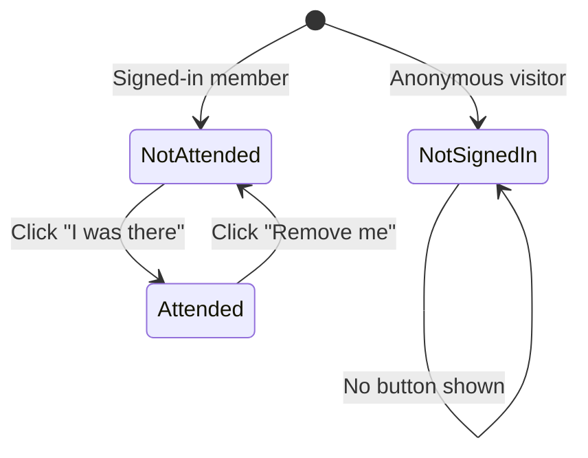

# Event Attendance

Authenticated members can self-report attendance at events. The button on each event row toggles between "I was there" and "Remove me" based on the signed-in member's current state. `ATTENDANCE_KV` is the single live source of truth; a scheduled workflow snapshots KV into the archival `data/attendance.json` ledger every 6 hours, and the ledger seeds KV exactly once when a new namespace is brought up.

Attendance is keyed on the **member id**. See [Identity](#identity) — that is what makes a rename land everywhere at once.

## Mark Attendance

```mermaid
sequenceDiagram
    actor User
    participant Events as jxnfilm.club/events
    participant Worker as Cloudflare Worker
    participant Cron as Snapshot workflow<br/>(every 6h)
    participant JSON as data/attendance.json

    User->>Events: Sees "I was there" on an event
    User->>Events: Clicks "I was there"
    Events->>Worker: POST /events/{id}/attend (bearer token)
    Worker->>Worker: Read attend:{id} (fallback to attendance:all)
    Worker->>Worker: Append { id, name }; write-through to<br/>attend:{id} + attendance:all
    Worker-->>Events: { attendees: [...] }
    Events->>User: Button flips to "Remove me",<br/>name appears in attendee list

    Note over Cron,Worker: Runs on cron, independent of clicks
    Cron->>Worker: GET /events/attendance (single KV GET of attendance:all)
    Worker-->>Cron: { attendance: {...} }
    Cron->>JSON: Rewrite file, commit if changed
```

## Remove Attendance

```mermaid
sequenceDiagram
    actor User
    participant Events as jxnfilm.club/events
    participant Worker as Cloudflare Worker

    User->>Events: Sees "Remove me" on an attended event
    User->>Events: Clicks "Remove me"
    Events->>Worker: DELETE /events/{id}/attend (bearer token)
    Worker->>Worker: Splice by member id; write-through to<br/>attend:{id} + attendance:all
    Worker-->>Events: { attendees: [...] }
    Events->>User: Button flips back to "I was there"

    Note over Worker: Ledger catches up on the next cron tick
```

## Button States


```mermaid
stateDiagram-v2
    [*] --> NotSignedIn: Anonymous visitor
    NotSignedIn --> NotSignedIn: No button shown

    [*] --> NotAttended: Signed-in member
    NotAttended --> Attended: Click "I was there"
    Attended --> NotAttended: Click "Remove me"
```

## Data Flow

`ATTENDANCE_KV` is the sole live source of truth. The repo ledger `data/attendance.json` is an archival snapshot, plus a one-shot bootstrap source when the KV namespace is cold.

**KV layout:**

| Key | Role |
|-----|------|
| `attend:{eventId}` | Canonical per-event attendee array of `{ id, name }` entries |
| `attendance:all` | Aggregate `{ eventId: [{ id, name }] }` — the bulk endpoint's O(1) read path |
| `attendance:bootstrapped` | Marker; presence means the repo→KV seed has already run |

**Reads:** `GET /events/attendance` reads `attendance:all` plus `events:all` (for the host overlay below) plus `members:all` (to resolve each entry's current name). `GET /events/:id/attendance` reads `attend:{id}` (falling back to the aggregate for events that don't have a per-event key yet) plus `event:{id}` plus `members:all`. The hot path never fetches from GitHub raw — the bulk endpoint reads `events:all` and `members:all` raw rather than through `readEventsAll()` / `readMembersAll()` precisely so it can't trigger either bootstrap.

**Writes:** `POST`/`DELETE /events/:id/attend` writes through to both `attend:{id}` and `attendance:all`, so the next bulk read reflects the change without extra work.

**Bootstrap:** on the first read against a fresh namespace, `bootstrapAttendance` fetches `https://raw.githubusercontent.com/<owner>/<repo>/<branch>/data/attendance.json`, seeds both `attendance:all` and every `attend:{id}` (live per-event entries, if any, win over baseline), then writes `attendance:bootstrapped`. Subsequent reads skip the network entirely.

The UI hydrates from `GET /events/attendance`. If the Worker is unreachable it renders an "attendance data is temporarily unavailable" banner rather than falling back to a potentially-stale static JSON; that keeps the displayed answer consistent with whatever the next successful fetch returns. After a click, the UI trusts the Worker's POST/DELETE response and mutates its local attendance map in place — no reconcile round-trip.

### Identity

An attendee entry is `{ id, name }`:

| Field | Meaning |
|-------|---------|
| `id` | The member id — or a synthetic `guest:xxxxxxxx` id for a host-added guest, or `null` for a row that predates the id migration and matched no member |
| `name` | A display-name **snapshot**. Only a fallback: it is what gets rendered when `id` resolves to nothing |

The id is canonical. Every read resolves names off `members:all`, so **a member who changes their display name is renamed everywhere their name appears at once** — attendee lists, the homepage leaderboard, their account stats, the host's guest list, the "Hosted by …" line, and (on the next cron tick) the `data/attendance.json` snapshot. Attendance was keyed on the display name until August 2026, which meant a rename orphaned every past row; the admin dashboard carried a "rename?" flag to surface exactly that, and it is gone because the condition can no longer arise.

Consequences worth knowing:

- **Letterboxd is still optional.** The identifier is the member id, never the handle, so members without Letterboxd participate the same way — they just render as plain text instead of a profile link.
- **Two members can share a display name.** They are separate rows and separate leaderboard entries. Under name-keying they were silently conflated, including by the deletion scrub.
- **Every read path accepts the legacy `[name]` shape** (`normalizeAttendees` in `worker/src/index.js`, `model/index.ts`, and `admin/lib.js`), so nothing breaks before the backfill runs. A legacy row still counts toward the member who answers to that name today — see `attendanceTally`.
- **`scripts/admin/backfill-attendance-ids.mjs`** attaches ids to the rows already in KV; it is what makes *old* rows follow a rename too. A member who renamed *before* it ran matches nobody, and has to be named explicitly with `--alias "Old Name=memberId"`.

#### The one-time migration

`data/attendance.json` was converted in the repo when the id keying landed; the KV pass is the same mapping, and one member had already renamed by then:

```bash
node scripts/admin/backfill-attendance-ids.mjs --alias "mia barranco=0cykofv8f6"          # dry run, production
node scripts/admin/backfill-attendance-ids.mjs --alias "mia barranco=0cykofv8f6" --apply
gh workflow run snapshot-attendance.yml
```

Two names are deliberately left at `id: null`, and re-running the script will keep reporting them as unmatched:

| Name | Why it stays unlinked |
|------|----------------------|
| `JSyd` (4 screenings) | Removed her membership without ticking the anonymize box, so the name stays as historical record — that is the documented default (see [member-profile.md](./member-profile.md)). There is no member row left to link to. |
| `Bryan` (1 screening) | No membership record ever existed — a guest. |

Both still count on the leaderboard under their own name; `attendanceTally` keys an id-less row on its name.

### Where a name is still copied

Two rows hold a name the member does not own, and both are resolved off an id at read time:

- `event.hostName` — resolved from `hostId` on `GET /events` (and therefore in the `data/events.json` snapshot).
- `rsvp:{eventId}` entries — resolved from `memberId` in the host's own `GET /events/:id/host` view.

Because outbound email and the admin dashboard read those rows raw, `/member/update` also rewrites both in place when the display name actually changes (`propagateNameChange`). That write-through is belt-and-braces; the read-time resolution is what the site actually depends on.

### Hosts count as attendees

A member-hosted screening's attendee list is its confirmed-RSVP list **plus the host** — they were in the room, so they show up in the attendee list, in `data/attendance.json`, and in the homepage attendance leaderboard.

The host is *not* an `rsvp.confirmed` entry. Capacity counts guest slots, so a synthetic host RSVP would eat one of the host's own seats, mail them their own address, and trip the "cannot reduce capacity below confirmed" guard on PATCH. Instead:

- **Write path** — `writeRsvp()` mirrors `[hostName, ...confirmedNames]` into `attend:{id}` (deduped) on every RSVP mutation, so the host is in KV, not just synthesized.
- **Read path** — `withHost()` overlays the host name on both attendance reads. This is what backfills screenings created before the rule: they never get another RSVP write, so a read-time overlay is the only thing that reaches them — and since the snapshot workflow reads `GET /events/attendance`, `data/attendance.json` (and therefore the leaderboard) picks them up on the next cron tick. **No KV migration is required.**
- **Capacity math** — `guestCount()` in `event-card` (and `isFull()` in `host-guests`) filter `event.hostName` out before comparing against `capacity`, matching the Worker. The "N / M RSVPed" meter therefore still counts guests only.
- **Host self-RSVP** — `POST /events/:id/rsvp` returns 409 for the host of that event; the card shows "You're hosting — you're already counted as attending" instead of an RSVP button.

Consequence, and it is deliberate: a host who deletes their account with `anonymize: true` has their name spliced out of `attend:*`, but `event.hostName` is untouched (their name still renders in the public "Hosted by …" line), so the overlay puts it back in the attendee list for events they hosted. Hosting is public attribution rather than a passive record, so it is **not** covered by the automatic scrub — `/privacy` says so in as many words and routes the removal to a by-hand request at `privacy@jxnfilm.club`, and the danger-zone checkbox repeats it. Three places to keep in sync if this ever changes: `worker/src/privacy.html`, the anonymize checkbox in `ui/auth.html`, and `anonymizeAttendance()` in `worker/src/index.js`.

## Persistence Cadence

`.github/workflows/snapshot-attendance.yml` runs every 6 hours (and on-demand via `workflow_dispatch`). It:

1. `GET`s `https://join.jxnfilm.club/events/attendance` (one KV read of `attendance:all`).
2. Sanity-checks the response shape.
3. Rewrites `data/attendance.json` with the returned map.
4. Commits only if the file actually changed.

This replaces the previous per-click `repository_dispatch` model. Rapid toggles no longer queue independent workflow runs, and the ledger converges within one cron tick of the last change.

## Environments

| Env | KV writes | Snapshot workflow target | Reads `data/attendance.json`? |
|-----|-----------|--------------------------|-------------------------------|
| Production (`ENVIRONMENT=production`) | yes | `join.jxnfilm.club` (scheduled) | once per namespace, via `bootstrapAttendance` |
| Staging (`ENVIRONMENT=staging`) | yes | none — staging is not snapshotted | once per namespace, via `bootstrapAttendance` |
| E2E (`E2E_MODE=true`) | yes | n/a | skipped — tests seed KV directly |

Staging shares the prod ledger only for seeding (read-only). Staging clicks stay in staging KV and are never committed anywhere.

## Attendee Display

- Members with a linked Letterboxd handle: name rendered as a link to their Letterboxd profile
- Members without Letterboxd: name rendered as plain text
- The literal string `former member` may appear when a deleted member opted into anonymization (see [member-profile.md](./member-profile.md)). It is rendered as plain text, never linked.
- The list comma-separates and wraps inside the attendance cell so many attendees don't blow out the column

## Error States

| Condition | HTTP | Behavior |
|-----------|------|----------|
| Not authenticated | 401 | Button not shown (frontend guard) |
| Member not found | 404 | "member not found" |
| Already attending (re-click) | 200 | Idempotent, no duplicate KV write |
| Not attending (re-remove) | 200 | No-op |
| Worker unreachable at hydrate | — | UI renders attendance-unavailable banner, toggle buttons hidden |
| Snapshot fetch fails in cron | workflow fails | Next tick retries; KV state unaffected |

## Maintenance Notes

- **Deploying new Worker code**: no special KV migration is needed. KV keeps its contents across deploys.
- **Creating a new KV namespace**: no import step required — the first read against the new namespace triggers `bootstrapAttendance`, which seeds `attendance:all` + every `attend:{id}` from the raw JSON and writes `attendance:bootstrapped`. This happens exactly once.
- **Re-bootstrapping from the ledger** (e.g. after a bad manual edit): delete `attendance:bootstrapped` in the KV namespace; the next read re-seeds from `data/attendance.json`, preserving any live per-event entries that already exist.
- **Forcing an immediate snapshot**: `gh workflow run snapshot-attendance.yml` (or the Actions tab "Run workflow" button).
- **Making KV agree about hosts** (optional): the public endpoints overlay the host on read, but the local admin dashboard and `contentgen` read raw `attend:*` keys and so miss hosts on screenings written before the rule. `node scripts/admin/backfill-host-attendance.mjs` (dry run; `--apply` to write, `--env staging` for staging) prepends the host to every hosted screening's array. Idempotent and re-runnable.
- **Rolling back**: `data/attendance.json` is the archival record. Reverting a commit rolls back the ledger; the next cron tick will rewrite the file from live KV state. If you want to revert BOTH KV and the ledger, wipe `attend:*` and `attendance:*` KV keys first (including `attendance:bootstrapped`), then revert the commit — the next read will re-bootstrap from the reverted JSON.
- **Staging isolation check**: after clicking in staging, confirm no snapshot commit lands. Staging KV never drives the snapshot workflow (it only queries prod's Worker).

## Local Testing

The snapshot workflow can be exercised locally with [`act`](https://github.com/nektos/act) — see [`docs/SETUP.md` §12](../SETUP.md#12-smoke-test-attendance-locally-with-act). For development iteration, `wrangler dev` alone is usually enough — KV updates are visible immediately via `GET /events/attendance`, no workflow needed.

## Key Files

| File | Role |
|------|------|
| `worker/src/index.js` | `handleAttend()`, `handleUnattend()`, `handleAttendanceGet()`, `handleAttendanceMap()`, `withHost()`, `readAttendees()`, `readAttendanceAll()`, `writeAttendees()`, `writeRsvp()`, `bootstrapAttendance()`, `fetchAttendanceBaseline()` |
| `worker/wrangler.toml` | `ENVIRONMENT` + `GITHUB_BRANCH` vars |
| `ui/views.html` | `events-view` loads + passes attendees to each `event-card`; `event-card` owns the attend/remove toggle |
| `css/cards.css` | `.attendance-list`, `.attend-btn`, `.attendance-unavailable` styles |
| `.github/workflows/snapshot-attendance.yml` | Cron-driven ledger snapshot |
| `data/attendance.json` | Durable ledger |
| `tests/worker/attendance.test.js` | Worker unit tests |
