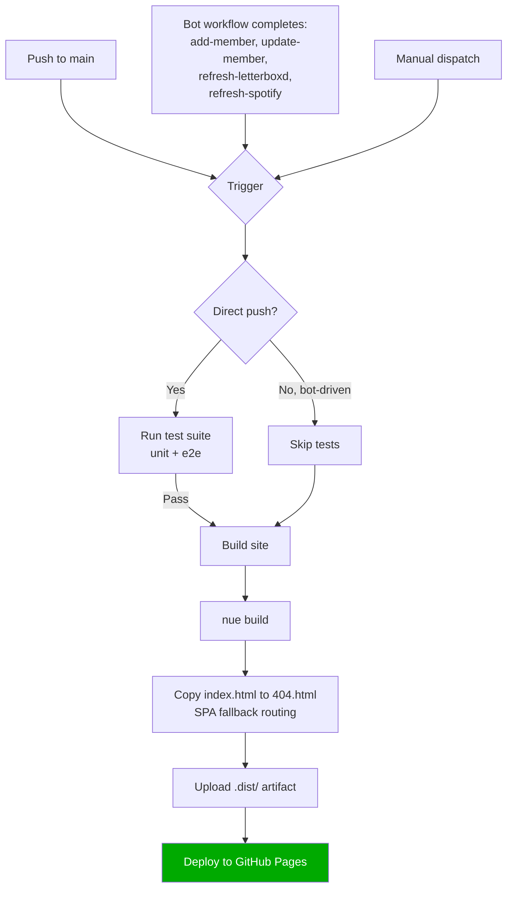
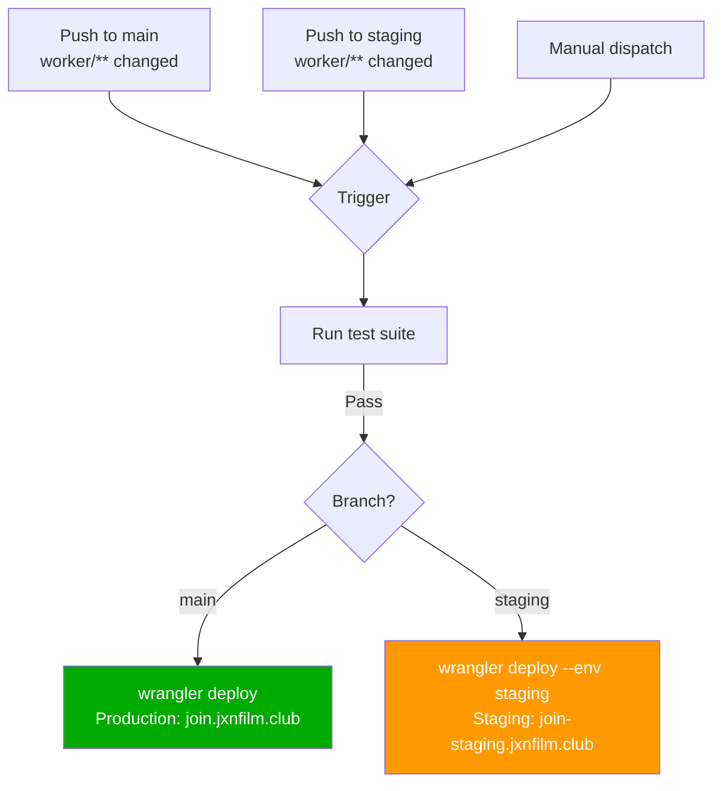

# Deployment

The project has two deploy targets: the static site (GitHub Pages) and the Worker API (Cloudflare Workers), each with CI gates and automated triggers.

## Site Deployment

### Concurrency

Deploy uses concurrency group `pages` with `cancel-in-progress: false`. Multiple triggers queue rather than cancel each other.

### SPA Routing

GitHub Pages serves `404.html` for unknown paths. Since `404.html` is a copy of `index.html`, the client-side SPA router handles deep links like `/events` or `/edit`.

## Worker Deployment

### Environments

| Environment | Domain | KV Namespaces |
|-------------|--------|---------------|
| Production | `join.jxnfilm.club` | Prod MEMBERS_KV + ATTENDANCE_KV |
| Staging | `join-staging.jxnfilm.club` | Staging MEMBERS_KV + ATTENDANCE_KV |

## CI: Build Check + Test

- **Build check** (`build-check.yml`): runs on PRs. Parallel site build (`npm run build`) + worker dry-run (`wrangler deploy --dry-run`).
- **Test** (`test.yml`): unit tests (`npm test`) + e2e tests (Playwright Chromium). Reusable workflow called by deploy pipelines. On failure: uploads `playwright-report/` artifact (7-day retention).

## Timing

The user-facing message "The public site rebuilds in ~30 seconds" reflects the approximate pipeline: GitHub Action dispatch -> workflow pickup -> build -> deploy.

## Key Files

| File | Role |
|------|------|
| `.github/workflows/deploy-site.yml` | Site build + deploy |
| `.github/workflows/deploy-worker.yml` | Worker deploy (prod/staging) |
| `.github/workflows/build-check.yml` | PR validation |
| `.github/workflows/test.yml` | Reusable test workflow |
