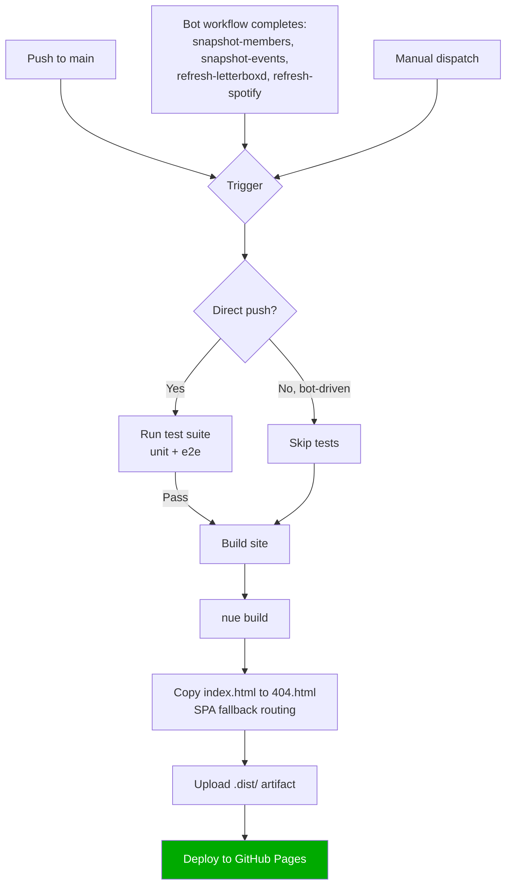
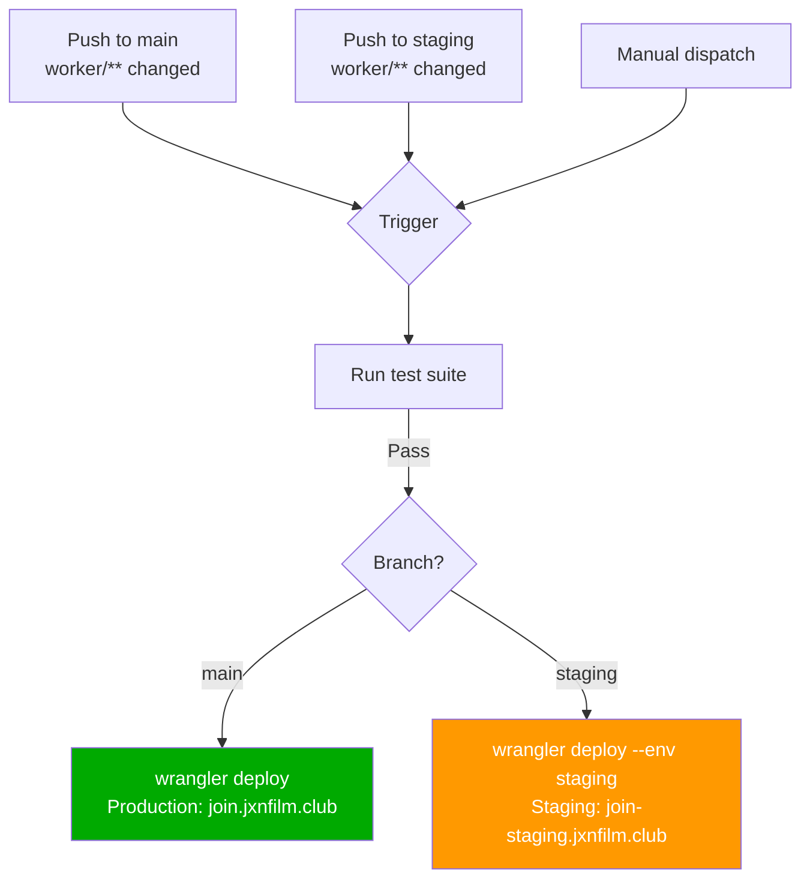

# Deployment

The project has three deploy targets: the static site (GitHub Pages), the Worker API (Cloudflare Workers), and the admin Worker (Cloudflare Workers, behind Cloudflare Access), each with CI gates and automated triggers.

## Site Deployment

```mermaid
flowchart TD
    A{Trigger} --> B

    A1[Push to main] --> A
    A2[Bot workflow completes:<br/>snapshot-members, snapshot-events,<br/>refresh-letterboxd, refresh-spotify] --> A
    A3[Manual dispatch] --> A

    B{Direct push?}
    B -->|Yes| C[Run test suite<br/>unit + e2e]
    B -->|No, bot-driven| D[Skip tests]

    C -->|Pass| E[Build site]
    D --> E

    E --> F[nue build]
    F --> G[Copy index.html to 404.html<br/>SPA fallback routing]
    G --> H[Upload .dist/ artifact]
    H --> I[Deploy to GitHub Pages]

    style I fill:#0a0,color:#fff
```

### Concurrency

Deploy uses concurrency group `pages` with `cancel-in-progress: false`. Multiple triggers queue rather than cancel each other.

### SPA Routing

GitHub Pages serves `404.html` for unknown paths. Since `404.html` is a copy of `index.html`, the client-side SPA router handles deep links like `/events` or `/edit`.

## Worker Deployment

```mermaid
flowchart TD
    A{Trigger} --> B[Run test suite]

    A1[Push to main<br/>worker/** changed] --> A
    A2[Push to staging<br/>worker/** changed] --> A
    A3[Manual dispatch] --> A

    B -->|Pass| C{Branch?}
    C -->|main| D[wrangler deploy<br/>Production: join.jxnfilm.club]
    C -->|staging| E[wrangler deploy --env staging<br/>Staging: join-staging.jxnfilm.club]

    style D fill:#0a0,color:#fff
    style E fill:#f90,color:#fff
```

### Environments

| Environment | Domain | KV Namespaces |
|-------------|--------|---------------|
| Production | `join.jxnfilm.club` | Prod MEMBERS_KV + ATTENDANCE_KV |
| Staging | `join-staging.jxnfilm.club` | Staging MEMBERS_KV + ATTENDANCE_KV |

## Admin Worker Deployment

The hosted admin portal (`admin.jxnfilm.club`, `admin/worker/`) is a single Worker that binds **all four** KV namespaces (prod + staging) with an in-app env switcher, so it deploys from `main` only — there is no staging variant. `deploy-admin.yml` triggers on pushes touching `admin/**`, gates on the reusable test workflow, and runs `wrangler deploy` from `admin/worker/`. The hostname is a Workers Custom Domain fronted by a Cloudflare Access application (One-time PIN); the Worker additionally verifies the Access JWT itself and fails closed. See `admin/README.md` and `docs/SETUP.md` §13.

## CI: Build Check + Test

- **Build check** (`build-check.yml`): runs on PRs. Parallel site build (`npm run build`) + worker dry-run (`wrangler deploy --dry-run`).
- **Test** (`test.yml`): unit tests (`npm test`) + e2e tests (Playwright Chromium). Reusable workflow called by deploy pipelines. On failure: uploads `playwright-report/` artifact (7-day retention).

## Timing

Member and event changes appear in the SPA **immediately** — the Worker is the live read source via `GET /members` and `GET /events`. The deploy chain no longer gates user-facing freshness; it only refreshes the static fallback JSON in `data/*.json`. The 6h `snapshot-members.yml` + `snapshot-events.yml` cron workflows commit the bot snapshot, then trigger `deploy-site.yml` via `workflow_run` so the static JSON catches up on the CDN.

`Add member` / `Update member` / `Remove member` workflows still fire on every member event but are no longer in `deploy-site.yml`'s `workflow_run` trigger list — they keep a near-realtime git audit trail of membership changes without burning CI minutes on a redeploy that produces no user-visible change.

## Key Files

| File | Role |
|------|------|
| `.github/workflows/deploy-site.yml` | Site build + deploy |
| `.github/workflows/deploy-worker.yml` | Worker deploy (prod/staging) |
| `.github/workflows/deploy-admin.yml` | Admin worker deploy (main only, serves both envs) |
| `.github/workflows/build-check.yml` | PR validation |
| `.github/workflows/test.yml` | Reusable test workflow |
| `.github/workflows/snapshot-members.yml` | 6h cron: snapshots `GET /members` → `data/members.json` |
| `.github/workflows/snapshot-events.yml` | 6h cron: snapshots `GET /events` → `data/events.json` |
| `.github/workflows/snapshot-attendance.yml` | 6h cron: snapshots `GET /events/attendance` → `data/attendance.json` |
