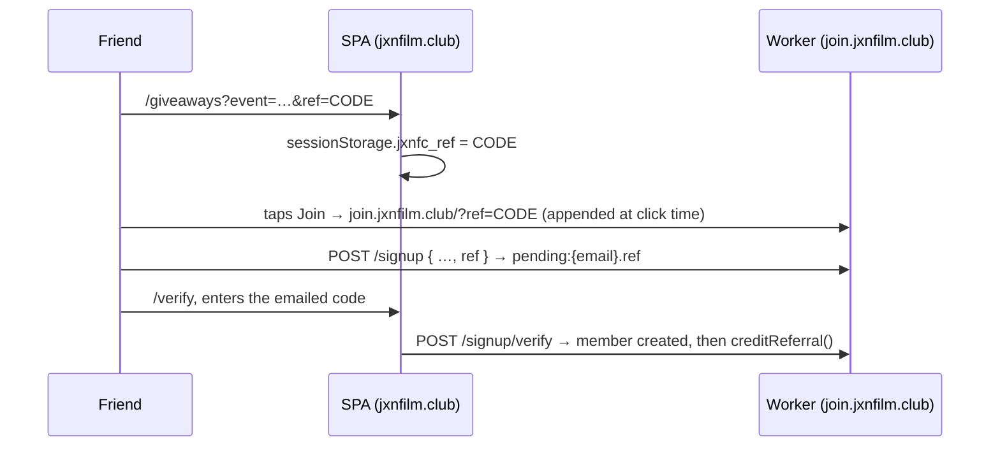

# Giveaways

Reusable, event-scoped prize draws. A giveaway belongs to one screening, runs
between two datetimes, and is drawn at random, weighted by entries. Built for
the Clayface preview at The Capri (Oct 22, 2026, with Offbeat and Mississippi
Film Society), where each giveaway awards 2 tickets. Nothing here is specific to
Clayface.

## At a glance

| | |
|---|---|
| Member page | `jxnfilm.club/giveaways?event=<event id>` (mobile-first; share this link) |
| Official rules | `join.jxnfilm.club/giveaways/<giveaway id>/rules` (public) |
| Admin | admin portal → **Giveaways** tab |
| Code | `worker/src/giveaways.js` (rules, draw), handlers in `worker/src/index.js`, `ui/giveaways.html` |
| Storage | D1 `GIVEAWAYS_DB`, schema in `worker/migrations/` |
| Tests | `tests/worker/giveaways.test.js`, `tests/e2e/giveaways.spec.ts` |

## How entering works

1. A **member** opens the giveaway page and presses **Enter**, ticking "I accept
   the official rules" (required) and optionally "Email me about future club
   giveaways". Membership is free, and entering never involves payment.
2. From then on, each qualifying action earns entries, worth the weight the
   giveaway sets for that source:

| Source | Earned by | Limit |
|---|---|---|
| `waitlist_signup` | an RSVP to the giveaway's event (for a ticketed event with no ticket link yet, every RSVP joins the pre-sale queue, i.e. the waitlist) | once |
| `letterboxd_link` | a linked Letterboxd profile whose public `/films/` page exists | once |
| `voice_prompt` | a clip on `/speak` for the giveaway's `voice_prompt_id` | once |
| `referral` | a friend who joins through your link **and verifies a new email** | once per friend, up to the giveaway's cap |

Entries are accepted only while `status = open` **and** the clock is inside
`[starts_at, ends_at)`, so a forgotten status flip can't extend a giveaway.

`count_prior_waitlist` (per giveaway, off by default) decides whether an RSVP
made **before** the giveaway opened still earns the waitlist entry. This policy
isn't decided yet, so it's a setting rather than code.

Entries are **derived, not claimed**. `syncEntries()` looks at the member's real
state (RSVP, handle, voice row) and `INSERT OR IGNORE`s one row per source. It
runs on Enter, after an RSVP, after a profile update, after a voice upload, and
when node0 reports a clip's measured length. Unique indexes make running it
again harmless, and concurrent requests can't create duplicates.

### Letterboxd

Linking now accepts a username, `@username`, or any `letterboxd.com/<name>/…`
profile URL. There's no Letterboxd API, so existence is checked by fetching the
public `/films/` page, the same page the avatar code uses because profile roots
sit behind a bot challenge. A **404 refuses the link**. A challenge or outage
lets the link through, and any giveaway entry it earns is **flagged** for
review. Results are cached for a day (`lbcheck:*` in KV).

### Voice

Only signed-in members can upload (`POST /voice` requires a session and explicit
consent). Audio stays in the private R2 bucket on its 60-day clock. Each
giveaway sets `voice_max_seconds` and `voice_max_bytes`.

- The 8 MB upload cap is enforced at upload.
- Length is checked against **node0's measurement**: `transcribe_service.mjs`
  runs ffprobe on the decoded audio and reports it with the caption draft (or
  via `/transcriber/measure` when whisper hears no speech). The browser's
  `X-Voice-Duration` header is only a claim.
- Until measured, the entry is flagged `length not yet measured`. It clears
  automatically if the clip is within limits and stays flagged if it's over.
- Deleting the clip withdraws the entry while the giveaway is open.

### Referrals

Each member has one stable 8-character code (`referral_codes`). Their link is
`jxnfilm.club/giveaways?event=…&ref=CODE`. Tracking survives signup like this:



Credit is decided at verification, against every open giveaway that counts
referrals and that the referrer has entered:

| Case | Outcome |
|---|---|
| Referee's email (normalized: case, `+tag`, Gmail dots) matches the referrer's | **rejected**: self-referral |
| Normalized email matches another existing member | **rejected**: alias of an existing member |
| Exact email already a member | signup itself refuses it (409); nothing recorded |
| Same person referred twice into one giveaway | ignored (unique index) |
| Disposable email domain (bundled list) | **flagged** |
| ≥ 3 referral signups from one network in 24h (keyed hash of the IP) | **flagged** |
| ≥ 5 referrals from one member in an hour (rate limit) | **flagged** |
| Referrer already at the cap | recorded as **capped**, no entry |

Flagged referrals still create an entry, but it's flagged: visible in admin,
**left out of the draw by default**, and never silently dropped. The cap is
enforced inside the `INSERT` itself (the count and the write are one
statement), so concurrent verifications can't overshoot it.

### Instagram giveaways

A giveaway whose only source is `instagram` (`{ how, post_url? }`) takes its
entries on Instagram, where the portal can't see them. The site still:

- **hosts its official rules** (`/giveaways/:id/rules`), with an Instagram
  variant: entry happens on Instagram, entrants don't have to be members,
  winners are picked by comment picker and contacted by DM;
- **lists it** on the event's giveaway page, with the how-to-enter steps and a
  link to the post (no Enter button, since `POST /enter` refuses it);
- **records its winners.** Once it's `closed` and over, the admin pastes the
  comment picker's result (`Jane Doe, @janedoe` per line) with a note. That
  writes a logged draw and winner rows, so the winners reach the box-office CSV.
  "No response" records one replacement.

Winners are stored under an opaque id (`ig-` plus a hash of the giveaway id and
handle). The name and handle live only on the participants row, which the
60-day scrub deletes. Nothing is stored about Instagram entrants who didn't win.

### One prize per person per event

A portal draw's pool excludes anyone currently holding a prize (`selected`) in
**any** giveaway for the same event, so a member can't win twice across the
Clayface giveaways. Instagram winners are keyed by handle, not member id, so
checking them against member names stays a manual step.

## Admin

**Giveaways tab** (both the hosted portal and `npm run admin`):

- **New / edit.** Event, title, prize, winners, tickets per winner (default 2),
  open/close datetimes (entered in your local time, stored as UTC), status,
  enabled sources with weights (plus the referral cap), `count_prior_waitlist`,
  voice prompt id and limits, winner reply window, and **additional terms**.
  Put the sponsor line, eligibility (such as minimum age) and anything specific
  to the giveaway in additional terms. The fixed legal lines (no purchase
  necessary, free membership, draw method, contact) are always rendered by the
  rules page itself.
- **Entries & draw.**
  - Counts by source (rows, entries, flagged, excluded).
  - Every entry, with its flag reason and an exclude/include toggle.
  - **Run the draw**, available once status is `closed` and the end time has
    passed. "Leave flagged entries out of the pool" is on by default.
  - **No response: redraw** forfeits a winner and draws one replacement from
    everyone not yet selected or forfeited.
  - The **draw log**: each run's time, who ran it (the Cloudflare Access
    email), pool size, SHA-256 of the pool, the CSPRNG integers used, and the
    result.
  - **CSV exports.** Full (name, email, tickets) for you. **Box office** (name,
    tickets) is what goes to The Capri: the privacy policy promises emails are
    never shared.

### The draw

The draw is weighted and **without replacement**: each pick chooses one ticket
uniformly from the remaining total weight, using `crypto.getRandomValues` with
rejection sampling (no modulo bias). The status flip to `drawn` and the winner
rows are one D1 batch (a transaction), so two admins clicking at once produce
one set of winners. The second click gets a 409.

To audit a draw: sort the pool `(member_id:weight)` lines, hash them (that's
`snapshot_sha256`), and replay `random_values` against the cumulative weights.

## Setup (once per environment)

Nothing is deployed from the feature branch. Before merging:

```bash
cd worker
npx wrangler d1 create jxnfilm-giveaways            # production
npx wrangler d1 create jxnfilm-giveaways-staging    # staging
# paste each database_id into wrangler.toml (the REPLACE_WITH_… placeholders)
npx wrangler d1 migrations apply jxnfilm-giveaways --remote
npx wrangler d1 migrations apply jxnfilm-giveaways-staging --remote --env staging
```

A new migration later goes in `worker/migrations/000N_*.sql` and is applied the
same way. Local runs and e2e use `--local` (Playwright applies it
automatically).

No new secrets are needed. The IP hash reuses `OTP_SIGNING_KEY` under its own
prefix.

If `GIVEAWAYS_DB` is unbound, every giveaway route answers 503 and every hook
is a no-op, so the rest of the Worker never depends on giveaways.

## Retention and privacy

- Participants, entries and referrals are deleted **60 days after a giveaway
  ends** (daily cron, `scrubGiveaways`).
- The giveaway row, draw log and winner rows stay. They hold random member ids
  only, no names or emails.
- Account deletion removes the member from every giveaway immediately, and
  forfeits them if they're a current winner.
- IPs are stored only as a keyed hash (`HMAC(OTP_SIGNING_KEY, "giveaway-ip:"+ip)`,
  truncated), used for the one-network check and nothing else.
- Privacy policy (`worker/src/privacy.html`) updated 2026-09-24 to match: what
  entering stores, referral records, the IP hash, the two sessionStorage keys,
  names-only to the venue, retention, and how to leave.

## Routes

| Route | Auth | Purpose |
|---|---|---|
| `GET /giveaways?event=` | public | event + its non-draft giveaways |
| `GET /giveaways/:id/me` | session | entered?, entries by source, referral link and count |
| `POST /giveaways/:id/enter` | session | `{ acceptRules: true, commsConsent? }` |
| `GET /giveaways/:id/rules` | public | official rules page (HTML) |
| `GET/PUT /admin/giveaways[/:id]` | ADMIN_TOKEN | list (drafts too) / create or update |
| `GET /admin/giveaways/:id/entries` | ADMIN_TOKEN | entries + counts by source |
| `POST /admin/giveaways/:id/entries/:entryId` | ADMIN_TOKEN | `{ excluded }` |
| `POST /admin/giveaways/:id/draw` · `/redraw` | ADMIN_TOKEN | draw / `{ memberId }` redraw; logs `X-Admin-Email` |
| `GET /admin/giveaways/:id/winners[.csv]` | ADMIN_TOKEN | winners + draw log / CSV (`?format=boxoffice`) |
| `POST /transcriber/measure` | TRANSCRIBE_TOKEN | node0's measured clip length |

## Running the Clayface giveaways

The event already exists: `2026-10-22-clayface` (ticketed, tickets pending, so
every RSVP is a waitlist entry).

1. **Waitlist giveaway, live by Oct 9.** Sources `waitlist_signup` (1) and
   `letterboxd_link` (1). Decide `count_prior_waitlist` before opening.
2. **Voice and referral giveaways.** Set `voice_prompt_id` to a prompt you
   publish in Config (`config:voice_prompt`), and choose the referral cap. Close
   them with time to draw **before Oct 20**.
3. After each closes: set status `closed`, then **Run the draw**. Email the
   winners (they have `winner_response_days` to reply). **Redraw** anyone who
   doesn't answer. Send the **box-office CSV** to The Capri.

Share `jxnfilm.club/giveaways?event=2026-10-22-clayface` on Instagram.
