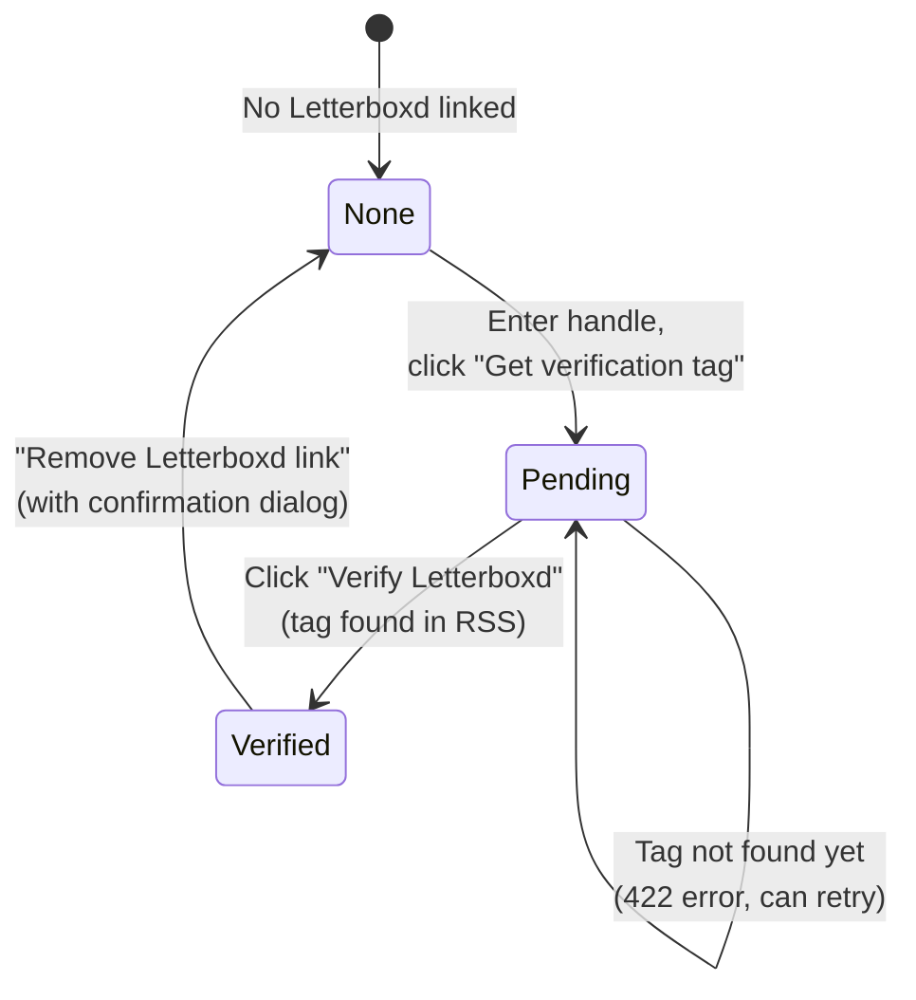
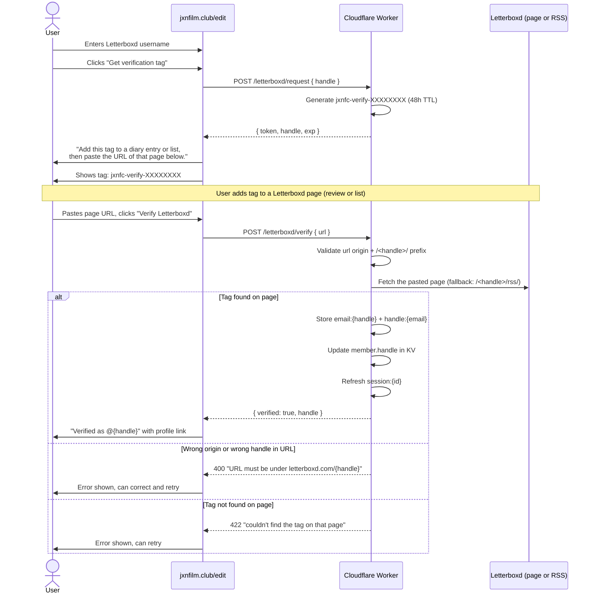

# Member Profile

Authenticated members manage their display name, pronouns, and Letterboxd link from the `/edit` page. Changes propagate to the public site via GitHub Actions.

## Profile Editing

```mermaid
sequenceDiagram
    actor User
    participant Site as jxnfilm.club/edit
    participant Worker as Cloudflare Worker
    participant GH as GitHub Actions

    Site->>Worker: GET /member/me (with session token)
    Worker->>Worker: Read session:{id} (fall back to<br/>member:{email} on miss; reseed)
    Worker-->>Site: { name, pronouns, handle, ... }
    Site->>User: Prefills form fields

    User->>Site: Edits name/pronouns, clicks "Save"
    Site->>Worker: POST /member/update { name, pronouns }
    Worker->>Worker: Update member:{email} in KV
    Worker->>Worker: Refresh session:{id} snapshot
    Worker->>GH: Dispatch update-member workflow
    Worker-->>Site: 200 OK

    Site->>User: "Saved. The public site rebuilds in ~30 seconds."

    GH->>GH: Update data/members.json
    GH->>GH: Commit + push
    Note over GH: Triggers deploy-site workflow
```

## Letterboxd Verification

Members can link their Letterboxd profile by adding a verification tag to a diary entry or list.



### Verification Sequence



URL-based verification is the primary path because Letterboxd's RSS feed
lags real-time edits and some list/diary shapes never surface there. The
Worker still accepts `POST /letterboxd/verify` with an empty body as a
compatibility fallback, in which case it scrapes `/<handle>/rss/`.

**SSRF safety**: the Worker only fetches URLs whose origin matches
`LETTERBOXD_BASE` (defaults to `https://letterboxd.com`) AND whose path
begins with `/<handle>/` (case-insensitive). A user can't claim another
handle by pointing at someone else's page.

### Unlink Confirmation

When removing a Letterboxd link, the user sees:
> "Remove your Letterboxd link? Your membership stays -- only the @handle disappears from the public directory."

## Error States

| Condition | HTTP | User sees |
|-----------|------|-----------|
| Handle claimed by another member | 409 | "this Letterboxd handle is already claimed" |
| No pending verification tag | 410 | "no pending verification -- request a new tag" |
| Handle not provided for verify | 400 | "add your Letterboxd handle first" |
| Malformed URL in verify body | 400 | "that doesn't look like a valid URL" |
| URL off letterboxd.com | 400 | "the URL must be on letterboxd.com" |
| URL path not under `/<handle>/` | 400 | "the URL must be under letterboxd.com/{handle}" |
| Tag not on pasted page | 422 | "couldn't find the tag on that page..." (can retry) |
| Tag not in RSS feed (fallback path) | 422 | "token not found on your Letterboxd RSS feed yet..." |
| No Letterboxd to unlink | 400 | "no Letterboxd linked" |

## Timing

- Letterboxd verification tag expires in **48 hours**
- Tag is preserved across sessions (set at signup or from /edit)
- `session:{id}` snapshot expires in **1 hour** (matches JWT exp); refreshed on every member-mutating write so the client sees its own updates on the next `/member/me`.

## Key Files

| File | Role |
|------|------|
| `worker/src/index.js` | `handleMemberMe()`, `handleMemberUpdate()`, `handleLbStatus()`, `handleLbRequest()`, `handleLbVerify()`, `handleLbUnlink()` |
| `ui/auth.html` | `edit-view` component (profile form + `.lb-panel`) |
| `.github/workflows/update-member.yml` | Commits profile changes |
| `tests/worker/member-update.test.js` | 5 unit tests |
| `tests/worker/letterboxd.test.js` | 13 unit tests |
| `tests/e2e/letterboxd.spec.ts` | 4 e2e tests |
