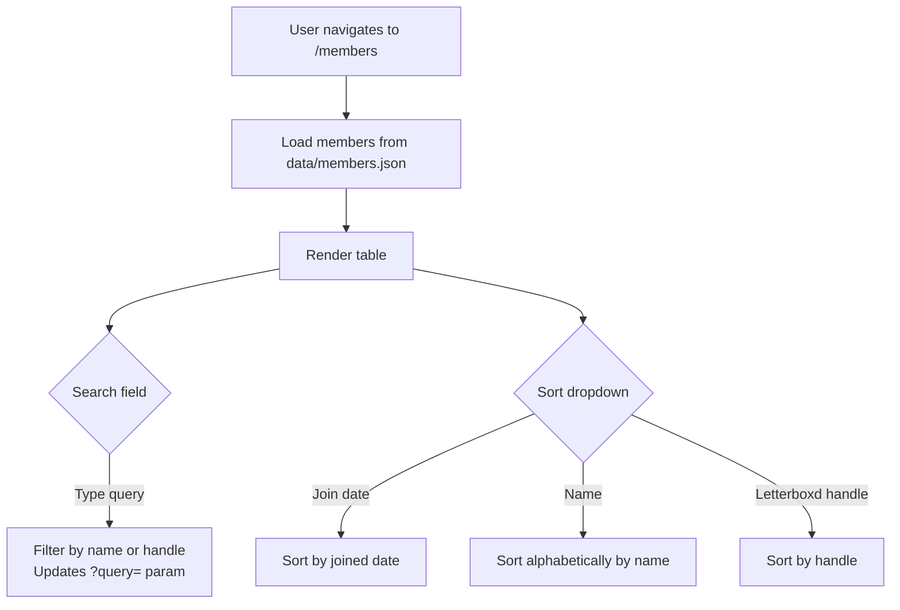

# Members Directory

A public, searchable, sortable directory of all club members at `/members`.

## Page Layout

The members view displays a table with:
- Avatar (deterministic background color from first letter of name)
- Display name
- Letterboxd handle (linked to profile, if verified)
- Join date (relative time via `<timeago>` widget)

Header shows total count: "{N} members".

## Interaction Flow

## Avatar Widget

Each member gets a deterministic avatar with a colored background:
- Color is derived from the first letter of the member's name
- 16 colors total (8 dark + 8 light), indexed by `(charCode - 97) / 2`
- Dark backgrounds get white text, light backgrounds get black text

## URL Parameters

| Param | Effect | Example |
|-------|--------|---------|
| `query` | Filters by name or handle | `?query=michael` |
| `sort` | Sort field | `?sort=name` or `?sort=handle` |

## Key Files

| File | Role |
|------|------|
| `ui/views.html` | `members-view` component |
| `ui/widgets.html` | `avatar` and `timeago` widgets |
| `model/index.ts` | `getMembers()` with search and sort |
| `data/members.json` | Member records |
| `tests/e2e/site.spec.ts` | 4 members-view + 1 avatar test |
| `tests/model/model.test.ts` | 4 getMembers tests |
