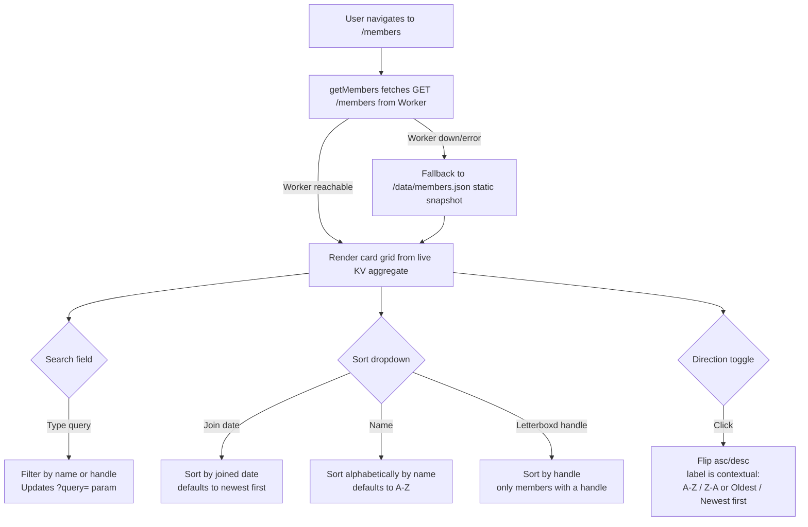

# Members Directory

A public, searchable, sortable directory of all club members at `/members`.

## Page Layout

Members render as a responsive card grid (`.card-grid.member-grid` in
`css/cards.css`), using CSS `grid-template-columns: repeat(auto-fit,
minmax(220px, 1fr))` so the column count follows viewport width without
explicit breakpoints — one column on phones, three to five on desktop.

Each card shows:
- Avatar (deterministic background color from first letter of name)
- Display name
- Letterboxd handle (linked to profile, if verified; or muted
  "no Letterboxd" label otherwise)
- `Joined <relative time>` via the `<timeago>` widget. `member.joined` is a
  full ISO instant (not a bare date) so the relative label is accurate to the
  minute; once a card falls back to an absolute date (10+ days old) it renders
  in **America/Chicago**, not the visitor's browser timezone. Legacy rows
  written before this used a bare `YYYY-MM-DD` — `<timeago>` detects that
  format and compares Central *calendar dates* directly (Today / Yesterday /
  N days ago / an absolute date) rather than computing real elapsed hours
  from a UTC-midnight parse, which used to misreport a same-Central-day join
  as "Yesterday" once UTC had already rolled to the next date. `admin.js`'s
  member table handles the same legacy format without shifting the date.

Above the grid: a result-count line (`N members`) plus the search +
sort header.

## Interaction Flow

```mermaid
flowchart TD
    A[User navigates to /members] --> B[getMembers fetches GET /members from Worker]
    B -->|Worker reachable| C[Render card grid from live KV aggregate]
    B -->|Worker down/error| Bfb[Fallback to /data/members.json static snapshot]
    Bfb --> C

    C --> D{Search field}
    D -->|Type query| E[Filter by name or handle<br/>Updates ?query= param]

    C --> F{Sort dropdown}
    F -->|Join date| G[Sort by joined date<br/>defaults to newest first]
    F -->|Name| H[Sort alphabetically by name<br/>defaults to A-Z]
    F -->|Letterboxd handle| I[Sort by handle<br/>only members with a handle]

    C --> J{Direction toggle}
    J -->|Click| K[Flip asc/desc<br/>label is contextual:<br/>A-Z / Z-A or Oldest / Newest first]
```

The sort `<select>` carries the sort *key*; the button beside it toggles the
*direction* by rewriting `?sort=` with an `-asc` / `-desc` suffix (the generic
suffix protocol in `model/index.ts`'s `sortBy()`). Its label is contextual —
"A → Z" / "Z → A" for the alphabetical sorts, "Newest first" / "Oldest first"
for join date. Picking a new key resets to that key's natural direction
(dates newest-first, text A→Z). The default view is `joined-desc` (newest
members first); bare legacy values like `?sort=name` still work and mean
ascending.

Sorting by Letterboxd handle also **filters the grid to members with a
handle** — handle-less members used to sort into a "no Letterboxd" block at
the front, which read as broken. The result count reflects the filtered set.

## Avatar Widget

Members with a linked Letterboxd handle show their Letterboxd avatar when the
Worker's `GET /avatars` map has one (see [watched.md](watched.md) — og:image
scrape, 7-day KV cache, default-avatar filtering). The widget's `:src` prop
renders the image with an `onerror` fallback to the letter avatar.

Everyone else gets the deterministic letter avatar with a colored background:
- Color is derived from the first letter of the member's name
- 16 colors total (8 dark + 8 light), indexed by `(charCode - 97) / 2`
- Dark backgrounds get white text, light backgrounds get black text

## URL Parameters

| Param | Effect | Example |
|-------|--------|---------|
| `query` | Filters by name or handle | `?query=michael` |
| `sort` | Sort key, optionally suffixed `-asc`/`-desc` | `?sort=name-asc`, `?sort=handle-desc`; bare `?sort=name` = ascending. Default `joined-desc`. `handle*` also filters to Letterboxd members |

## Key Files

| File | Role |
|------|------|
| `ui/views.html` | `members-view` component |
| `ui/widgets.html` | `avatar` and `timeago` widgets |
| `css/cards.css` | `.member-grid` + `.member-card` layout |
| `model/index.ts` | `getMembers()` with search and sort; fetches the Worker first, falls back to `/data/members.json` |
| `worker/src/index.js` | `GET /members` → `members:all` aggregate; bootstrap from `data/members.json` on cold KV |
| `data/members.json` | Archival snapshot, refreshed every 6h by `.github/workflows/snapshot-members.yml` |
| `tests/worker/members-events.test.js` | Worker-side coverage of `GET /members` |
| `tests/e2e/site.spec.ts` | 4 members-view + 1 avatar test |
| `tests/model/model.test.ts` | 4 getMembers tests |
