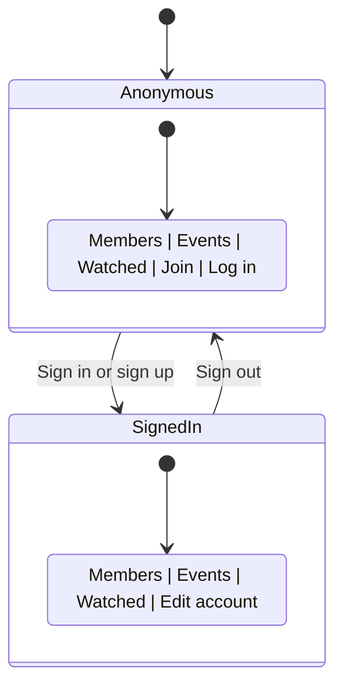

# Navigation & Auth State

The site navigation adapts based on authentication state. The SPA uses client-side routing via Nue's `state` module with URL-based route parameters.

## Nav States



- **Anonymous**: "Join" links to `https://join.jxnfilm.club/` (external), "Log in" links to `/signin`
- **Signed in**: "Edit account" links to `/edit` (on jxnfilm.club, not join.jxnfilm.club)

## Session Management

Sessions are stored in `localStorage.jxnfc_session` with the following structure:

```json
{
  "token": "base64url-encoded JWT",
  "email": "user@example.com",
  "id": "randomId",
  "name": "Display Name",
  "handle": "letterboxd-handle or null",
  "exp": 1234567890000
}
```

Session validity check: `s?.token && s.exp > Date.now()`

## SPA Routing

| URL | View | Route param |
|-----|------|-------------|
| `/` | `home-view` | (default) |
| `/members` | `members-view` | `type=members` |
| `/events` | `events-view` | `type=events` |
| `/watched` | `watched-view` | `type=watched` |
| `/signin` | `sign-in-view` | `type=signin` |
| `/verify` | `verify-view` | `type=verify` |
| `/edit` | `edit-view` | `type=edit` |

### Query Parameters

| Param | Used by | Purpose |
|-------|---------|---------|
| `query` | members, events | Search filter |
| `sort` | members, events | Sort field/direction |
| `venue` | events | Venue filter |
| `email` | verify, signin | Prefill email field |
| `event` | edit | Event ID for attendance removal |

## External Link Handling

Nue's `autolink` intercepts all anchor clicks for SPA routing. A capture-phase click handler prevents this for:
- Cross-origin links (e.g., `join.jxnfilm.club`, `letterboxd.com`)
- Links with `target="_blank"`

## Key Files

| File | Role |
|------|------|
| `index.html` | SPA shell, router setup, nav template |
| `ui/auth.html` | `getSession()`, `setSession()` |
| `ui/views.html` | `getSession()` in events-view |
