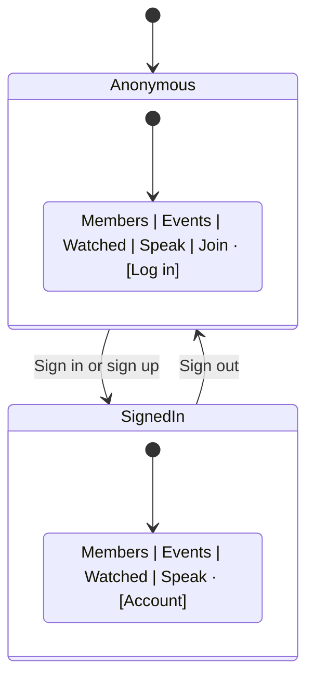

# Navigation & Auth State

The site navigation adapts based on authentication state. The SPA uses client-side routing via Nue's `state` module with URL-based route parameters.

## Nav States


```mermaid
stateDiagram-v2
    [*] --> Anonymous
    Anonymous --> SignedIn: Sign in or sign up
    SignedIn --> Anonymous: Sign out

    state Anonymous {
        [*] --> AnonymousNav
        AnonymousNav: Members | Events | Watched | Speak | Join · [Log in]
    }

    state SignedIn {
        [*] --> SignedInNav
        SignedInNav: Members | Events | Watched | Speak · [Account]
    }
```

- **Anonymous**: "Join" links to `https://join.jxnfilm.club/` (external) and is the masthead's one solid-red action; "Log in" links to `/signin`
- **Signed in**: "Account" links to `/edit` (on jxnfilm.club, not join.jxnfilm.club) — profile edits, Letterboxd link, host-a-screening, membership deletion
- **Speak** links to `/speak`, for everyone. It used to be deliberately unlinked and reached by newsletter; once members could send the club a message rather than only answer a prompt, an entry point you can only find in an email stopped making sense.

### The auth chip sits outside the collapse

Join lives inside `.mastnav-links`. The auth chip — "Log in", or "Account" when signed in — lives in a separate `.mastnav-auth` group rendered before `.nav-toggle`, so the hamburger never hides it. On a phone it was previously two taps *and* invisible until you opened the menu, which made logging back in harder to find than joining for the first time; it is one tap now, on the logo row.

`.mastnav-links` is `display: contents` at desktop, which is *how* `.auth-link`'s `margin-left: auto` right-aligns the group by document order — so `.mastnav-auth` matches it there, and only becomes a real flex box inside the 640px block, where explicit `order` keeps it on the logo row while the link list wraps below.

### Return-to after login

Verification used to land on `/edit` unconditionally. A member who clicked "Log in" from `/speak` therefore arrived somewhere else with no way back, which was most of why logging in felt like a dead end.

The landing is now `globalThis.jxnfcNext()`, backed by `sessionStorage.jxnfc_next`:

- Written by the capture-phase click listener in `index.html` — the only place that sees every anchor click before nuestate's bubble-phase autolink — when a `/signin` link is clicked from somewhere else.
- Read (and cleared) at all three `location.href` landings in `ui/auth.html`, including `sign-in-view.mounted()`'s already-signed-in bounce.
- Validated against a **literal path allowlist** on both write and read. Not a regex: `//evil.example` and its backslash variant both look same-origin, and there are only a handful of routes worth supporting.

**Not a `?next=` query param.** nuestate's `getQueryData`/`renderQuery` read and emit only the keys registered in `state.setup`, so an unregistered param never survives an SPA navigation — and a registered one is worse, because `api.set` runs `save() → fire() → pushURLState()`, so `sign-in-view.mounted()` would read the *previous* page's `location.search`. sessionStorage sidesteps both and dies with the tab.

## Responsive Behavior

The mastnav is a horizontal flex row above 640px. At `max-width: 640px` it collapses behind a hamburger toggle (`.nav-toggle`); the link group (`.mastnav-links`) is hidden and revealed by toggling `.open` on the nav, driven by a `menuOpen` flag on `index.html`'s root component. The flag is reset to `false` on every route change so the menu auto-closes after navigation.

## Session Management

Sessions are stored in `localStorage.jxnfc_session` with the following structure:

```json
{
  "token": "base64url-encoded JWT",
  "email": "user@example.com",
  "id": "randomId",
  "name": "Display Name",
  "handle": "letterboxd-handle or null",
  "exp": 1234567890000
}
```

Session validity check: `s?.token && s.exp > Date.now()`

## SPA Routing

| URL | View | Route param |
|-----|------|-------------|
| `/` | `home-view` | (default) |
| `/members` | `members-view` | `type=members` |
| `/events` | `events-view` | `type=events` |
| `/watched` | `watched-view` | `type=watched` |
| `/signin` | `sign-in-view` | `type=signin` |
| `/verify` | `verify-view` | `type=verify` |
| `/edit` | `edit-view` | `type=edit` |

### Query Parameters

| Param | Used by | Purpose |
|-------|---------|---------|
| `query` | members, events | Search filter |
| `sort` | members, events | Sort field/direction |
| `venue` | events | Venue filter |
| `email` | verify, signin | Prefill email field |
| `event` | edit | Event ID for attendance removal |

## External Link Handling

Nue's `autolink` intercepts all anchor clicks for SPA routing. A capture-phase click handler prevents this for:
- Cross-origin links (e.g., `join.jxnfilm.club`, `letterboxd.com`)
- Links with `target="_blank"`

## Site Footer

`index.html` renders a quiet `footer.site-footer` after `<main>` (styles in
`css/global.css`): the club wordmark line plus Privacy
(`https://join.jxnfilm.club/privacy` — cross-origin, so autolink is bypassed)
and Contact (`mailto:privacy@jxnfilm.club`) links. It's the main site's only
link to the privacy policy — keep it if the footer is redesigned.

## Key Files

| File | Role |
|------|------|
| `index.html` | SPA shell, router setup, nav template |
| `ui/auth.html` | `getSession()`, `setSession()` |
| `ui/views.html` | `getSession()` in events-view |
