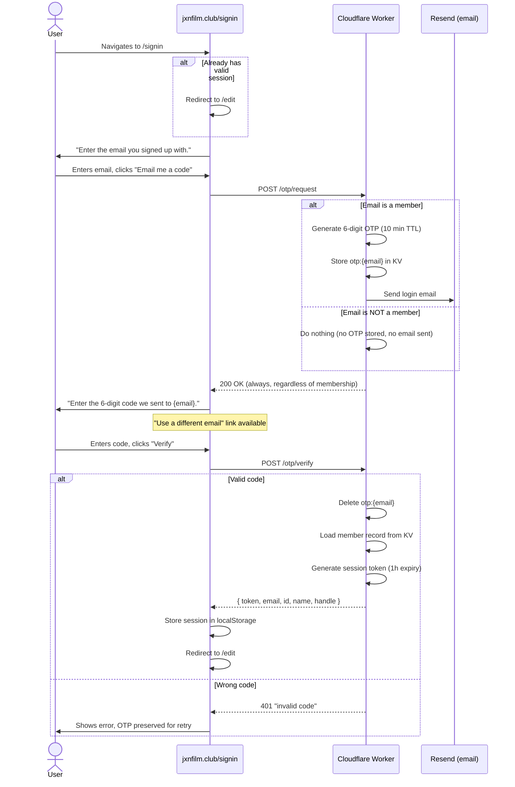

# Sign-in (Returning Members)

Returning members authenticate with a passwordless email OTP flow. The system intentionally does not reveal whether an email address is registered (anti-enumeration).

## User Flow

## Anti-Enumeration Design

The `POST /otp/request` endpoint always returns `200 OK` whether or not the email is registered. This prevents attackers from discovering which emails are club members.

## Error States

| Condition | HTTP | User sees |
|-----------|------|-----------|
| Unknown email | 200 | Normal code-entry step (but no email arrives) |
| Wrong code | 401 | "invalid code" |
| Correct code but no member record | 403 | "no member linked to this email" |
| Missing email | 400 | "email required" |
| Tampered/expired token | 401 | Unauthorized |

## Timing

- OTP code expires in **10 minutes**
- Session token expires in **1 hour**
- OTP is preserved on wrong-code attempts (user can retry)

## Key Files

| File | Role |
|------|------|
| `worker/src/index.js` | `handleOtpRequest()`, `handleOtpVerify()` |
| `ui/auth.html` | `sign-in-view` component |
| `tests/worker/otp.test.js` | 7 unit tests |
| `tests/e2e/signin.spec.ts` | 4 e2e tests |
