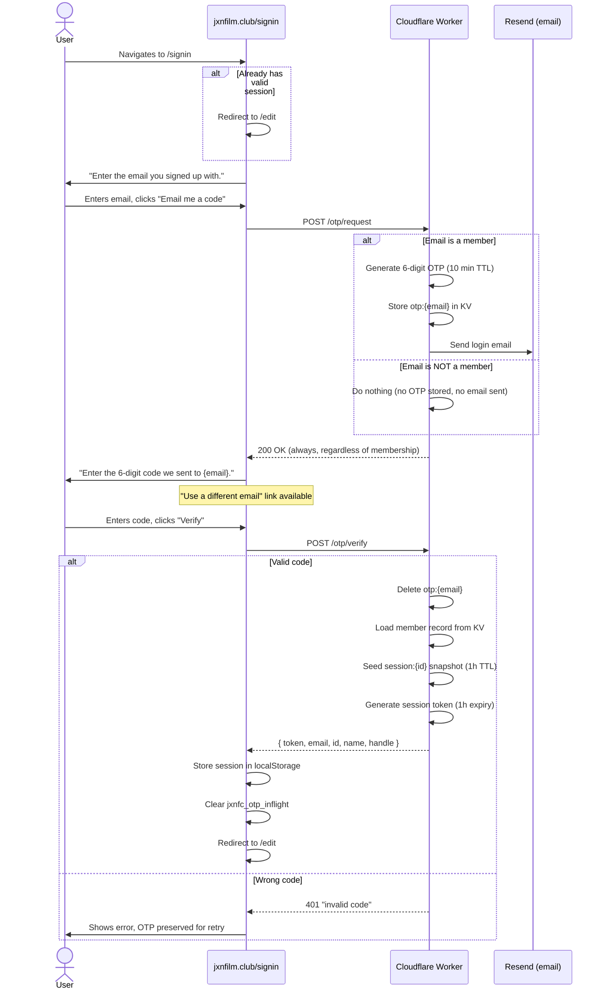

# Sign-in (Returning Members)

Returning members authenticate with a passwordless email OTP flow. The system intentionally does not reveal whether an email address is registered (anti-enumeration).

## User Flow

```mermaid
sequenceDiagram
    actor User
    participant Site as jxnfilm.club/signin
    participant Worker as Cloudflare Worker
    participant Email as Resend (email)

    User->>Site: Navigates to /signin
    alt Already has valid session
        Site->>Site: Redirect to /edit
    end

    Site->>User: "Enter the email you signed up with."
    User->>Site: Enters email, clicks "Email me a code"
    Site->>Worker: POST /otp/request

    alt Email is a member
        Worker->>Worker: Generate 6-digit OTP (10 min TTL)
        Worker->>Worker: Store otp:{email} in KV
        Worker->>Email: Send login email
    else Email is NOT a member
        Worker->>Worker: Do nothing (no OTP stored, no email sent)
    end
    Worker-->>Site: 200 OK (always, regardless of membership)

    Site->>User: "Enter the 6-digit code we sent to {email}."
    Note over Site: "Use a different email" link available
    User->>Site: Enters code, clicks "Verify"
    Site->>Worker: POST /otp/verify

    alt Valid code
        Worker->>Worker: Delete otp:{email}
        Worker->>Worker: Load member record from KV
        Worker->>Worker: Seed session:{id} snapshot (1h TTL)
        Worker->>Worker: Generate session token (1h expiry)
        Worker-->>Site: { token, email, id, name, handle }
        Site->>Site: Store session in localStorage
        Site->>Site: Clear jxnfc_otp_inflight
        Site->>Site: Redirect to /edit
    else Wrong code
        Worker-->>Site: 401 "invalid code"
        Site->>User: Shows error, OTP preserved for retry
    end
```

## In-flight Resume

When `POST /otp/request` returns 200, the site writes
`localStorage.jxnfc_otp_inflight = { email, sentAt }`. On subsequent `/signin`
mounts with no active session, the view skips straight to the code-entry step
with the email pre-filled — matching the Worker's 10-minute OTP TTL. The
entry is cleared on verify success, on "Use a different email", and on sign
out; it naturally expires client-side after 10 minutes.

## Anti-Enumeration Design

The `POST /otp/request` endpoint always returns `200 OK` whether or not the email is registered. This prevents attackers from discovering which emails are club members.

## Error States

| Condition | HTTP | User sees |
|-----------|------|-----------|
| Unknown email | 200 | Normal code-entry step (but no email arrives) |
| Wrong code | 401 | "invalid code" |
| Correct code but no member record | 403 | "no member linked to this email" |
| Missing email | 400 | "email required" |
| Malformed email | 400 | "invalid email format" |
| 5+ wrong codes for same email | 429 | "too many attempts — request a new code" |
| Tampered/expired/revoked token | 401 | Unauthorized |

## Rate Limits (S1 hardening)

- `POST /otp/request` is throttled to **one email per 60 seconds per address**. Repeats inside the window silently 200 (no email sent) to preserve anti-enumeration.
- `POST /otp/verify` and `POST /signup/verify` track failed-code attempts in `rate:otp_verify_fail:{email}` and `rate:signup_verify_fail:{email}`. After **5 failures within the 10-minute OTP window**, further attempts return 429 until the window expires.
- A successful verify clears the counter.

## Session Revocation (S2 hardening)

- Issued JWTs carry a random `jti`. `POST /session/revoke` (authenticated) writes `revoked:{jti}` with TTL matching the token's remaining lifetime; `verifyToken` consults this on every authenticated read.
- Revoking a session also deletes the `session:{id}` snapshot so cached reads can't be replayed.
- Sessions are per-token: revoking one device does not log out another. To "log out everywhere", revoke each token in turn.

## Timing

- OTP code expires in **10 minutes**
- Session token expires in **1 hour**
- OTP is preserved on wrong-code attempts (user can retry, up to 5)

## Key Files

| File | Role |
|------|------|
| `worker/src/index.js` | `handleOtpRequest()`, `handleOtpVerify()` |
| `ui/auth.html` | `sign-in-view` component |
| `tests/worker/otp.test.js` | 7 unit tests |
| `tests/e2e/signin.spec.ts` | 4 e2e tests |
