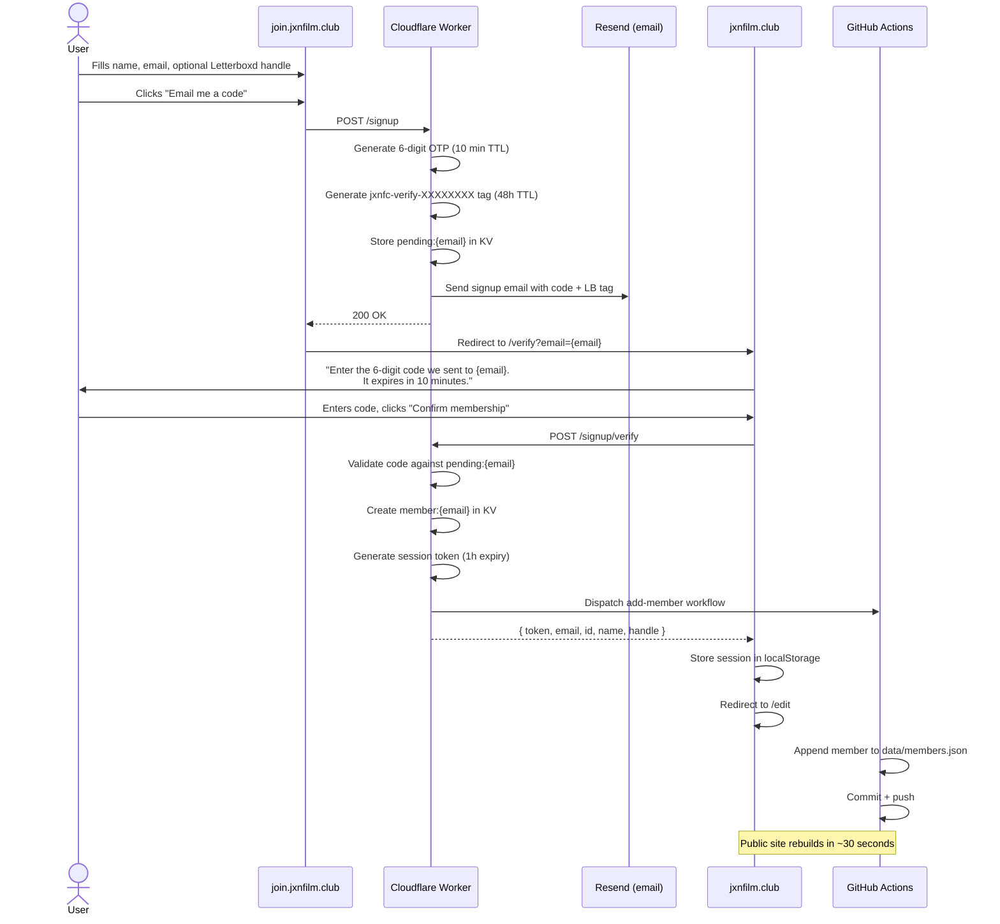

# Signup (New Member Registration)

New users join Jackson Film Club by providing a display name, email, and optionally a Letterboxd username. The flow spans two domains: the signup form lives on `join.jxnfilm.club` (Cloudflare Worker), and email verification completes on `jxnfilm.club` (static site).

## User Flow

## Error States

| Condition | HTTP | User sees |
|-----------|------|-----------|
| Email already registered | 409 | "this email is already a member -- try signing in" |
| Letterboxd handle claimed | 409 | "this Letterboxd handle is already claimed" |
| Invalid handle format | 400 | Form validation error |
| Missing name or email | 400 | "email required" / "name required" |
| Wrong verification code | 401 | "invalid code" |
| Expired or missing pending signup | 404 | "no pending signup -- start over" |

## Timing

- OTP code expires in **10 minutes**
- Letterboxd verification tag persists for **48 hours** (so the user can verify later from /edit)
- Session token expires in **1 hour**

## Key Files

| File | Role |
|------|------|
| `worker/src/index.js` | `handleSignup()`, `handleSignupVerify()` |
| `worker/src/signup.html` | Signup form template at join.jxnfilm.club |
| `ui/auth.html` | `verify-view` component |
| `.github/workflows/add-member.yml` | Commits new member to data/members.json |
| `tests/worker/signup.test.js` | 9 unit tests |
| `tests/e2e/signup.spec.ts` | 7 e2e tests |
