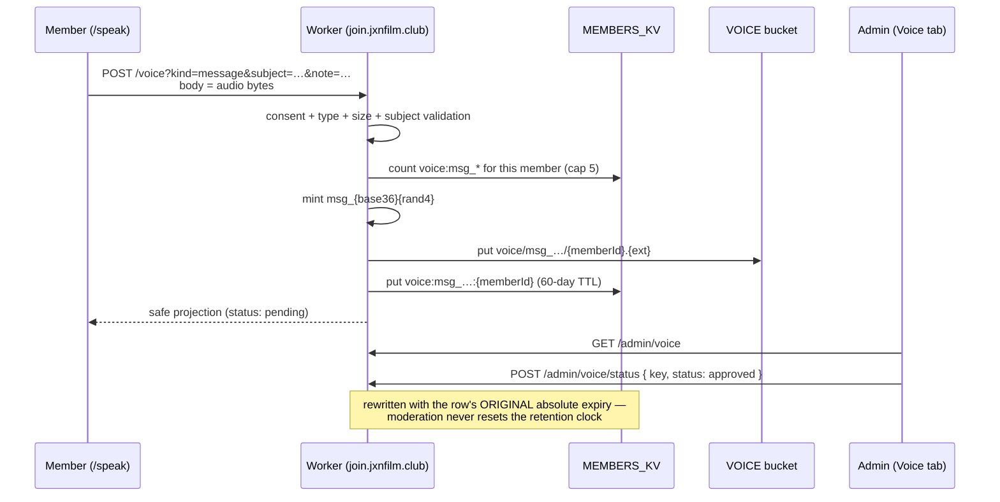

# Voice: getting on the podcast

`/speak` is how a member's voice reaches the JXN Film Club podcast. There are two
ways in, and they are the same recorder underneath:

- **Answer this round** — the prompt an admin configured (`config:voice_prompt`).
  One clip per member per round; recording again replaces it.
- **Send a message** — the member writes their own subject and records against it.
  As many as five live at a time, each listed and deleted on its own.

Members only, in both modes. Audio is required in both; a message additionally
carries the subject and an optional note.

## The idea that makes it small

**A round is not a record. It is a segment of a KV key.**

```text
voice:{promptId}:{memberId}
```

`promptId` comes from `config:voice_prompt.id`. So a free-form message is just a
round the member authored and is the only member of — the server mints a
`promptId` for it in a reserved namespace and writes an ordinary voice row:

```text
KV    voice:msg_m1kq4x8za7f3:{memberId}
R2    voice/msg_m1kq4x8za7f3/{memberId}.{ext}
SRT   voice/msg_m1kq4x8za7f3/{memberId}.srt
```

Everything keyed on that shape keeps working with no migration and no forked
handler: `/voice/history`, `/voice/audio`, `DELETE /voice`, all five
`/admin/voice` routes, `purgeVoiceClips`, `compile_voices.mjs`,
`make_audiogram.mjs`, and the TUI.

### Why the underscore

`sanitizeVoicePrompt` (`admin/lib.js`) slugifies a prompt id with
`.replace(/[^a-z0-9]+/g, '-')`, so an admin-authored id **provably cannot contain
`_`** — the message namespace is unreachable from the Config form by
construction. A `msg-` prefix *would* be reachable (`"Msg 4"` → `msg-4`).

The reservation is enforced anyway, in both `voicePrompt()` and `handleConfigGet`,
because `admin/server.mjs`'s raw `PUT /api/kv` and the E2E `/__test/kv` shim
write arbitrary keys and bypass the form. A `msg_` id in config reads as
malformed and falls through to the default prompt.

`validPromptId` is untouched: `msg_…` is a strict subset of it.

## Flow



## The row

Written by `handleVoiceSubmit`; the member-facing projection
(`voiceClipProjection`) is a whitelist, so new fields are private by default.

| Field | Notes |
|---|---|
| `memberId`, `name`, `handle?` | credit is resolved server-side; `name` is a submission-time snapshot |
| `promptId`, `promptText` | for a message, `promptText` **is** the member's subject |
| `kind` | `'message'`, or absent for a round answer — no backfill needed |
| `note` | messages only, optional |
| `r2Key`, `contentType`, `size`, `duration?` | `duration` is a client claim |
| `consent` | always `true`; the request is refused without it |
| `at`, `expiresAt` | `expiresAt` mirrors the TTL so rewrites can preserve it |
| `status` | `pending` → `approved` \| `rejected` |
| `transcript?` | `{ reviewedAt, bytes }`, admin-only, never projected to the member |

`promptText` carries the subject rather than a separate `subject` field on
purpose: `make_audiogram.mjs` headlines `clips[0].promptText`, and both
`groupVoiceClips` and the TUI's `group_rounds` label a group from it. One field
means the member's own words reach all three unchanged, and there is nothing to
drift.

## Validation, and where member text goes

| Field | Rule |
|---|---|
| `subject` | required for a message; 3–80 **UTF-16 code units**; no control characters |
| `note` | optional; ≤ 500 UTF-16 code units; newlines allowed |

Invisible formatting characters — zero-width (`U+200B`–`U+200F`, `U+FEFF`) and the
bidi overrides and isolates (`U+202A`–`U+202E`, `U+2066`–`U+2069`) — are **stripped**
rather than refused, before the length bound is applied. They all pass the
control-character check, and a right-to-left override renders a subject reversed in
the admin list, the TUI and the audiogram frame (`Report\u202Egnp.exe` reads as a PNG
to the operator triaging it). None has a use in a line that will be read aloud, and
refusing text the member cannot see would be unactionable.

80 rather than 120 because `scripts/assets/audiogram.html` clamps the frame title
to three lines.

The bound is **UTF-16 code units, not characters** — `String.length`. An emoji
costs 2 (so 40 🎬 pass and 41 are refused) and an NFD accented letter costs 2 as
well. That is the right unit for the reason the cap exists, since the audiogram's
three-line clamp is about rendered width rather than codepoint count, but it does
mean a subject can be refused while looking shorter than 80 to the member.

Metadata rides in **query params, not headers**: `fetch()` throws a `TypeError`
on a non-Latin1 header value, so the first member to type a curly apostrophe or
an accented title would have failed in the browser before the request left.

The subject travels to KV (JSON, inert), the admin portal (`escapeHtml`), the
audiogram frame (`instantiateTemplate` HTML-escapes `{{TITLE}}`), the SPA (dhtml
interpolation escapes) and the TUI (`rich.markup.escape` — Textual markup is
**not** escaped for you, and this was a real break). It never reaches a
filesystem or R2 path: those are built from the minted id and the member id
only. That is the reason the subject is not slugified into the id.

## Limits

| Limit | Value | Where |
|---|---|---|
| Clip length | 3 minutes | client-side; an over-length upload is accepted and trimmed at render |
| Clip size | 8 MB | `VOICE_MAX_BYTES`, checked on both `Content-Length` and actual bytes |
| Retention | 60 days | `VOICE_TTL` + the bucket-wide R2 lifecycle rule |
| Live messages | up to 5 per member | `VOICE_MESSAGE_CAP` |
| Round submit throttle | 60s | `rate:voice_submit:{email}`, first submissions only |
| Message throttle | 60s | `rate:voice_msg:{email}`, its own cell |

**The cap is a soft bound and the copy says so.** It is a list+get scan, and KV
list is eventually consistent, so two genuinely concurrent submits can both pass
a check at four; worst case is cap+1. The throttle is what makes beating it need
concurrency rather than a loop. A per-member index would tighten it and
reintroduce the `members:all` read-modify-write clobber race — not worth it for a
storage bound. Say "up to five", never "exactly five".

## Status ladder

`Submitted` → `Approved` → `Published`, and the last step is **round-scoped**:
publishing writes `config:voice_published` and means "the episode actually
aired". Approval can precede it by weeks.

A message belongs to no round, so it stops at `Approved — we plan to use this`.
The Messages group in the admin portal has no publish toggle, deliberately:
muddying the approval/publication distinction for a second content type costs
more than the feature is worth, and per-message publication stays additive.

## Deletion

- Member: `DELETE /voice?promptId=…` from the submissions list, per row.
- Admin: `DELETE /admin/voice { key }`.
- Account deletion: `purgeVoiceClips` walks the whole `voice:` prefix and matches
  on `row.memberId`.
- Otherwise: the 60-day R2 lifecycle rule plus the matching KV TTL.

Every path deletes the audio **and the derived `.srt` sidecar**
(`deleteClipObjects`). The transcript key is derived from the audio key rather
than stored, and before this was fixed a reviewed transcript of a member's words
outlived their account until the bucket swept it — against a policy that promises
deletion is "immediate and complete".

The two clocks are not synchronized (KV's TTL is exact, R2's lifecycle sweeps
daily), so **a KV row outliving its R2 object is an expected state**, not an
error: `/voice/audio` answers 404, and the UI relabels the row "audio expired".

## Getting a message into an episode

```bash
node scripts/make_audiogram.mjs --prompt msg_… --with-prompt --clips-only
```

`--clips-only` matters: without it, `make_audiogram.mjs` also renders a one-clip
"segment" credited to *"1 member · JXN Film Club"*, discarding the speaker
credit — the opposite of what the format is for.

`node scripts/compile_voices.mjs msg_…` also works, producing a one-clip segment.

## Finding /speak

In the nav, for everyone. That reverses an earlier decision that `/speak` was
unlinked and "travelled by newsletter" — an open mic you can only find in an
email is not open. Signed out, the band shows the prompt and offers **Log in to
record** and **Join the club** as the two different things they are, and logging
in from `/speak` returns to `/speak` (see [Navigation](navigation.md)).

## Related

- [Home Page](home.md) — the landing-page voice CTA band and the Spotify embed
- [Navigation](navigation.md) — the masthead auth group and return-to
- `admin/README.md` § "Compiling a podcast segment" — the operator pipeline
- `tui/README.md` — the Textual TUI over the same jobs
